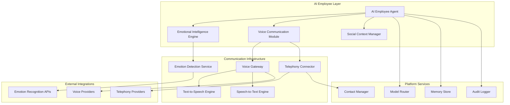

# AI Employee Communication System Design

## Overview

The AI Employee Communication System transforms the existing enhanced agents into human-like AI employees with advanced emotional intelligence, voice capabilities, and multi-modal communication. The system extends the current EnhancedBaseAgent architecture to include voice synthesis, emotion recognition, social awareness, and telephony integration while maintaining enterprise-grade security and observability.

## Architecture

### High-Level Architecture



### Component Architecture

The system follows a layered architecture with clear separation of concerns:

1. **AI Employee Layer**: Enhanced agents with human-like capabilities
2. **Communication Infrastructure**: Voice, telephony, and emotion processing
3. **Platform Services**: Core platform integration and data management
4. **External Integrations**: Third-party voice and telephony providers

## Components and Interfaces

### 1. AI Employee Agent (Enhanced)

Extends the existing `EnhancedBaseAgent` with emotional and social capabilities using template-based configuration.

```python
class AIEmployeeAgent(EnhancedBaseAgent):
    """AI Employee with human-like communication capabilities"""
    
    def __init__(self, employee_template: EmployeeTemplate, **kwargs):
        super().__init__(**kwargs)
        self.template = employee_template
        self.personality = employee_template.personality_profile
        self.emotional_state = EmotionalState()
        self.social_context = SocialContextManager()
        self.voice_profile = employee_template.voice_profile
        self.relationship_memory = RelationshipMemory()
        
    @classmethod
    async def create_from_template(cls, template_id: str, **overrides):
        """Create AI employee from predefined template with optional overrides"""
        template = await EmployeeTemplateManager.get_template(template_id)
        return cls(employee_template=template.apply_overrides(overrides))
```

**Key Interfaces:**
- `communicate_with_human(message, channel, emotional_context)`
- `communicate_with_ai(target_agent, message, observable=True)`
- `initiate_phone_call(contact, urgency_level, context)`
- `process_emotional_cues(input_data)`
- `adapt_communication_style(recipient_profile)`

### 2. Emotional Intelligence Engine

Processes emotional context and generates appropriate responses.

```python
class EmotionalIntelligenceEngine:
    """Core emotional processing and response generation"""
    
    async def analyze_emotional_context(self, input_data: CommunicationInput) -> EmotionalContext
    async def generate_emotional_response(self, context: EmotionalContext) -> EmotionalResponse
    async def update_relationship_state(self, participant_id: str, interaction: Interaction)
    async def detect_emotional_needs(self, conversation_history: List[Message]) -> List[EmotionalNeed]
```

**Emotional Processing Pipeline:**
1. Input analysis (text, voice tone, context)
2. Emotion detection and classification
3. Relationship context retrieval
4. Response generation with appropriate emotional tone
5. Relationship state update

### 3. Voice Communication Module

Handles all voice-related functionality including synthesis, recognition, and real-time conversation.

```python
class VoiceCommunicationModule:
    """Advanced voice communication with emotional expression"""
    
    async def synthesize_speech(self, text: str, emotion: Emotion, voice_profile: VoiceProfile) -> AudioStream
    async def recognize_speech(self, audio_stream: AudioStream) -> SpeechRecognitionResult
    async def establish_voice_connection(self, participants: List[str]) -> VoiceSession
    async def process_real_time_conversation(self, session: VoiceSession) -> ConversationFlow
```

**Voice Features:**
- Real-time speech synthesis with emotional expression
- Multi-language support
- Voice cloning and personalization
- Conversation flow management
- Interrupt handling and natural pauses

### 4. Social Context Manager

Manages social awareness, cultural sensitivity, and relationship building.

```python
class SocialContextManager:
    """Social awareness and relationship management"""
    
    async def analyze_social_cues(self, interaction: Interaction) -> SocialContext
    async def build_relationship_profile(self, participant_id: str) -> RelationshipProfile
    async def adapt_communication_style(self, recipient: str, context: SocialContext) -> CommunicationStyle
    async def manage_group_dynamics(self, participants: List[str]) -> GroupDynamics
```

**Social Intelligence Features:**
- Cultural awareness and adaptation
- Personality matching and mirroring
- Relationship history tracking
- Group dynamics management
- Conflict detection and resolution

### 5. Telephony Connector

Integrates with telephony providers for phone calling capabilities.

```python
class TelephonyConnector:
    """Phone calling and telephony integration"""
    
    async def initiate_call(self, contact: Contact, context: CallContext) -> CallSession
    async def handle_incoming_call(self, call_data: IncomingCall) -> CallResponse
    async def leave_voicemail(self, contact: Contact, message: str) -> VoicemailResult
    async def manage_call_routing(self, call_session: CallSession) -> RoutingDecision
```

**Telephony Features:**
- Multi-provider support (Twilio, AWS Connect, etc.)
- International calling capabilities
- Voicemail management
- Call recording and transcription
- Emergency calling protocols

## Data Models

### Core Data Structures

```python
@dataclass
class EmployeeTemplate:
    """Template for creating AI employees with shared configurations"""
    template_id: str
    template_name: str
    personality_profile: PersonalityProfile
    voice_profile: VoiceProfile
    communication_settings: CommunicationSettings
    role_permissions: RolePermissions
    default_capabilities: List[str]
    
    def apply_overrides(self, overrides: Dict[str, Any]) -> 'EmployeeTemplate':
        """Apply individual overrides to template"""
        # Create copy with specific overrides applied
        pass

@dataclass
class PersonalityProfile:
    """AI Employee personality configuration"""
    name: str
    traits: Dict[str, float]  # Big Five personality traits
    communication_style: CommunicationStyle
    voice_characteristics: VoiceCharacteristics
    cultural_background: CulturalProfile
    expertise_domains: List[str]

@dataclass
class EmotionalState:
    """Current emotional state of AI employee"""
    primary_emotion: Emotion
    intensity: float
    confidence: float
    triggers: List[str]
    duration: timedelta
    last_updated: datetime

@dataclass
class RelationshipProfile:
    """Relationship data with specific individual"""
    participant_id: str
    relationship_type: RelationshipType
    trust_level: float
    communication_preferences: CommunicationPreferences
    shared_history: List[Interaction]
    personal_details: Dict[str, Any]
    last_interaction: datetime

@dataclass
class VoiceProfile:
    """Voice characteristics and preferences"""
    voice_id: str
    language: str
    accent: str
    speaking_rate: float
    pitch_range: Tuple[float, float]
    emotional_expressiveness: float
    custom_pronunciations: Dict[str, str]

@dataclass
class CommunicationInput:
    """Input data for communication processing"""
    content: str
    channel: CommunicationChannel
    sender_id: str
    timestamp: datetime
    audio_data: Optional[bytes]
    emotional_markers: List[EmotionalMarker]
    context_metadata: Dict[str, Any]

@dataclass
class Contact:
    """Contact information for telephony"""
    contact_id: str
    name: str
    phone_numbers: List[PhoneNumber]
    availability_schedule: Schedule
    communication_preferences: ContactPreferences
    emergency_contact: bool
    relationship_context: str
```

### Emotional Intelligence Models

```python
class Emotion(Enum):
    JOY = "joy"
    SADNESS = "sadness"
    ANGER = "anger"
    FEAR = "fear"
    SURPRISE = "surprise"
    DISGUST = "disgust"
    TRUST = "trust"
    ANTICIPATION = "anticipation"
    NEUTRAL = "neutral"

class CommunicationChannel(Enum):
    VOICE_REAL_TIME = "voice_real_time"
    VOICE_ASYNC = "voice_async"
    TEXT_CHAT = "text_chat"
    VIDEO_CALL = "video_call"
    PHONE_CALL = "phone_call"
    EMAIL = "email"

class RelationshipType(Enum):
    COLLEAGUE = "colleague"
    MANAGER = "manager"
    DIRECT_REPORT = "direct_report"
    CLIENT = "client"
    VENDOR = "vendor"
    FRIEND = "friend"
    ACQUAINTANCE = "acquaintance"
```

## Error Handling

### Communication Failures

```python
class CommunicationErrorHandler:
    """Handles various communication failure scenarios"""
    
    async def handle_voice_synthesis_failure(self, context: VoiceContext) -> FallbackResponse:
        # Fallback to text communication
        return await self.generate_text_fallback(context)
    
    async def handle_phone_call_failure(self, contact: Contact, error: CallError) -> AlternativeAction:
        # Try alternative communication methods
        alternatives = [
            self.send_text_message,
            self.send_email,
            self.schedule_callback
        ]
        return await self.try_alternatives(contact, alternatives)
    
    async def handle_emotion_detection_failure(self, input_data: CommunicationInput) -> EmotionalContext:
        # Use neutral emotional context as fallback
        return EmotionalContext.neutral()
```

### Graceful Degradation

The system implements multiple fallback mechanisms:

1. **Voice to Text**: If voice synthesis fails, fall back to text communication
2. **Phone to Digital**: If phone calls fail, try SMS, email, or chat
3. **Emotion Detection**: Use neutral emotional context if detection fails
4. **Model Failures**: Route to alternative AI models via model router
5. **Network Issues**: Queue messages for retry with exponential backoff

## Testing Strategy

### Unit Testing

```python
class TestEmotionalIntelligence:
    """Test emotional intelligence capabilities"""
    
    async def test_emotion_detection_accuracy(self):
        # Test emotion detection with various inputs
        pass
    
    async def test_emotional_response_generation(self):
        # Test appropriate emotional responses
        pass
    
    async def test_relationship_building(self):
        # Test relationship profile updates
        pass

class TestVoiceCommunication:
    """Test voice communication features"""
    
    async def test_speech_synthesis_quality(self):
        # Test voice quality and emotional expression
        pass
    
    async def test_real_time_conversation(self):
        # Test conversation flow and interruption handling
        pass
    
    async def test_multi_language_support(self):
        # Test multiple language capabilities
        pass
```

### Integration Testing

```python
class TestAIEmployeeIntegration:
    """Test full AI employee communication scenarios"""
    
    async def test_human_ai_conversation(self):
        # Test complete human-AI interaction
        pass
    
    async def test_ai_to_ai_communication(self):
        # Test AI employee collaboration
        pass
    
    async def test_phone_call_scenario(self):
        # Test end-to-end phone calling
        pass
    
    async def test_emergency_escalation(self):
        # Test emergency communication protocols
        pass
```

### Performance Testing

- **Voice Latency**: < 200ms for real-time voice synthesis
- **Emotion Processing**: < 100ms for emotion detection and response generation
- **Phone Call Setup**: < 5 seconds for call initiation
- **Concurrent Conversations**: Support 100+ simultaneous voice sessions
- **Memory Usage**: Efficient relationship and conversation history storage

## Security and Privacy

### Data Protection

```python
class CommunicationSecurityManager:
    """Manages security and privacy for AI employee communications"""
    
    async def encrypt_voice_data(self, audio_stream: AudioStream) -> EncryptedAudio:
        # End-to-end encryption for voice communications
        pass
    
    async def anonymize_conversation_logs(self, conversation: Conversation) -> AnonymizedLog:
        # Remove PII while preserving emotional and social context
        pass
    
    async def validate_phone_permissions(self, contact: Contact, context: CallContext) -> bool:
        # Ensure AI employee has permission to call specific contacts
        pass
```

### Privacy Controls

- **Consent Management**: Explicit consent for voice recording and emotion analysis
- **Data Retention**: Configurable retention policies for conversation data
- **Access Controls**: Role-based access to AI employee communication logs
- **Anonymization**: Automatic PII removal from stored conversations
- **Audit Trails**: Complete audit logs for all communication activities

## Monitoring and Observability

### Performance Metrics

```python
class CommunicationMetrics:
    """Tracks AI employee communication performance"""
    
    emotional_accuracy: float  # Accuracy of emotion detection
    relationship_building_score: float  # Success in building relationships
    voice_quality_rating: float  # Voice synthesis quality
    conversation_satisfaction: float  # Human satisfaction with conversations
    phone_call_success_rate: float  # Successful phone call completion rate
    response_appropriateness: float  # Contextual appropriateness of responses
```

### Real-time Monitoring

- **Conversation Quality**: Real-time analysis of conversation effectiveness
- **Emotional State Tracking**: Monitor AI employee emotional states
- **Relationship Health**: Track relationship building progress
- **System Performance**: Voice latency, processing times, error rates
- **Usage Analytics**: Communication patterns and preferences

## Deployment Architecture

### Microservices Deployment

```yaml
# Kubernetes deployment structure
services:
  - ai-employee-core
  - emotional-intelligence-engine
  - voice-communication-service
  - telephony-connector
  - social-context-manager
  - emotion-detection-service
  - relationship-memory-store

infrastructure:
  - Redis: Real-time conversation state
  - PostgreSQL: Relationship and conversation history
  - Elasticsearch: Conversation search and analytics
  - WebRTC: Real-time voice communication
  - Message Queue: Asynchronous communication processing
```

### Scalability Considerations

- **Template-Based Creation**: Create thousands of employees from shared templates
- **Lazy Loading**: Load employee configurations on-demand
- **Bulk Operations**: Efficient batch processing for configuration updates
- **Horizontal Scaling**: Stateless services for easy scaling
- **Load Balancing**: Distribute voice processing across multiple instances
- **Caching**: Redis for conversation state and relationship data with template caching
- **CDN**: Global distribution of voice models and assets
- **Auto-scaling**: Dynamic scaling based on communication volume
- **Configuration Streaming**: Stream configuration updates to active employees
- **Database Sharding**: Partition employee data across multiple databases

## Scalable Configuration Management

### Employee Template System

To efficiently manage hundreds of AI employees, the system uses a template-based approach:

```python
class EmployeeTemplateManager:
    """Manages AI employee templates and bulk operations"""
    
    async def create_template(self, template_config: TemplateConfig) -> EmployeeTemplate:
        """Create reusable employee template"""
        pass
    
    async def bulk_create_employees(self, template_id: str, count: int, overrides: List[Dict]) -> List[AIEmployeeAgent]:
        """Create multiple employees from template efficiently"""
        pass
    
    async def update_template(self, template_id: str, updates: Dict) -> None:
        """Update template and optionally apply to existing employees"""
        pass
    
    async def apply_bulk_configuration(self, employee_ids: List[str], config_updates: Dict) -> BulkUpdateResult:
        """Apply configuration changes to multiple employees"""
        pass
```

### Configuration Hierarchy

```
Organization Level
├── Department Templates (HR, Marketing, Engineering)
│   ├── Role Templates (Manager, Specialist, Coordinator)
│   │   ├── Individual Employee Overrides
│   │   └── Personal Customizations
│   └── Shared Department Settings
└── Global Organization Settings
```

### API Configuration Management

Instead of configuring hundreds of employees individually, the API provides efficient bulk management:

```python
# Single API call to create entire department
POST /api/v1/employees/bulk-create
{
    "template_id": "customer_service_rep",
    "count": 50,
    "department": "customer_service",
    "naming_pattern": "CS-Agent-{index}",
    "overrides": {
        "voice_profile.language": "en-US",
        "personality_profile.traits.extraversion": 0.8
    }
}

# Bulk configuration update
PUT /api/v1/employees/bulk-update
{
    "filter": {
        "department": "sales",
        "role": "specialist"
    },
    "updates": {
        "communication_settings.phone_calling_enabled": true,
        "voice_profile.speaking_rate": 1.1
    }
}

# Template-based management
POST /api/v1/templates
{
    "name": "Senior Sales Representative",
    "personality_profile": {...},
    "voice_profile": {...},
    "permissions": {...}
}
```

### Configuration Inheritance

Each AI employee inherits configuration in this order (later overrides earlier):
1. **Organization Defaults**: Base settings for all employees
2. **Department Template**: Department-specific configurations
3. **Role Template**: Role-specific settings
4. **Individual Overrides**: Employee-specific customizations

This allows you to:
- Set organization-wide policies once
- Configure department-specific behaviors
- Define role-based templates
- Customize individual employees only when needed

### Bulk Management API

```python
class BulkEmployeeManager:
    """Efficient bulk operations for AI employees"""
    
    async def create_department(self, dept_config: DepartmentConfig) -> List[AIEmployeeAgent]:
        """Create entire department with role-based templates"""
        pass
    
    async def update_organization_policy(self, policy_updates: Dict) -> None:
        """Update policies across all employees"""
        pass
    
    async def schedule_bulk_training(self, employee_filter: EmployeeFilter, training_config: TrainingConfig) -> None:
        """Schedule training updates for filtered employees"""
        pass
```

## Integration Points

### Existing Platform Integration

The AI Employee Communication System integrates with existing platform components:

1. **EnhancedBaseAgent**: Extends with communication capabilities using templates
2. **Model Router**: Routes to specialized emotion and voice models
3. **Memory Store**: Stores relationship and conversation data with efficient indexing
4. **Audit Logger**: Logs all communication activities with bulk processing
5. **Multi-tenant Architecture**: Supports tenant-specific templates and bulk configurations

### External Service Integration

- **Voice Providers**: OpenAI Voice, ElevenLabs, Azure Cognitive Services
- **Telephony**: Twilio, AWS Connect, Vonage
- **Emotion Recognition**: Microsoft Emotion API, Google Cloud AI
- **Translation**: Google Translate, Azure Translator for multi-language support
- **Calendar Integration**: Schedule-aware communication timing