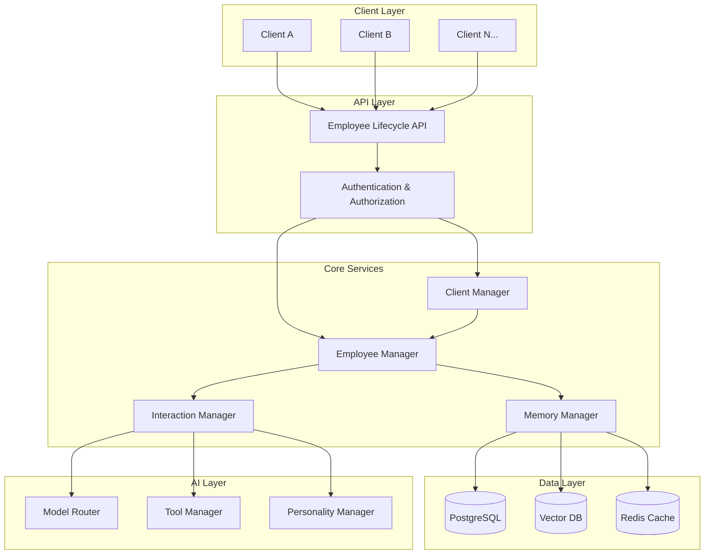

# AI Employee Lifecycle System Design

## Overview

This design implements a complete AI employee lifecycle system that enables clients to create unique, isolated AI employees with personalized behavior and scalable architecture. The system provides end-to-end functionality from client onboarding to employee interactions.

## Architecture



## Core Components

### 1. Employee Manager

The central service for managing AI employee lifecycle:

```python
class EmployeeManager:
    """Manages AI employee creation, configuration, and lifecycle"""
    
    def __init__(self, db_manager, memory_manager, model_router):
        self.db_manager = db_manager
        self.memory_manager = memory_manager
        self.model_router = model_router
        self.active_employees = {}  # Cache for loaded employees
    
    async def create_employee(
        self,
        client_id: str,
        requirements: EmployeeRequirements
    ) -> Employee:
        """Create a new AI employee from client requirements"""
        
        # Generate unique employee ID
        employee_id = f"{client_id}_emp_{uuid.uuid4().hex[:8]}"
        
        # Create employee configuration
        employee_config = await self._generate_employee_config(requirements)
        
        # Create employee record
        employee = Employee(
            id=employee_id,
            client_id=client_id,
            name=employee_config.name,
            role=employee_config.role,
            personality=employee_config.personality,
            model_preferences=employee_config.model_preferences,
            tool_access=employee_config.tool_access,
            knowledge_sources=employee_config.knowledge_sources,
            created_at=datetime.utcnow(),
            status=EmployeeStatus.ACTIVE
        )
        
        # Store in database
        await self._store_employee(employee)
        
        # Initialize employee memory namespace
        await self.memory_manager.initialize_employee_namespace(
            client_id, employee_id
        )
        
        return employee
    
    async def load_employee(
        self,
        client_id: str,
        employee_id: str
    ) -> Optional[Employee]:
        """Load employee configuration and context"""
        
        # Check cache first
        cache_key = f"{client_id}:{employee_id}"
        if cache_key in self.active_employees:
            return self.active_employees[cache_key]
        
        # Load from database
        employee = await self._load_employee_from_db(client_id, employee_id)
        if not employee:
            return None
        
        # Load recent memory context
        employee.memory_context = await self.memory_manager.get_employee_context(
            client_id, employee_id, limit=50
        )
        
        # Cache for future use
        self.active_employees[cache_key] = employee
        
        return employee
    
    async def interact_with_employee(
        self,
        client_id: str,
        employee_id: str,
        message: str,
        context: Dict[str, Any] = None
    ) -> EmployeeResponse:
        """Handle interaction with an AI employee"""
        
        # Load employee
        employee = await self.load_employee(client_id, employee_id)
        if not employee:
            raise EmployeeNotFoundError(f"Employee {employee_id} not found")
        
        # Create interaction context
        interaction = EmployeeInteraction(
            employee_id=employee_id,
            client_id=client_id,
            message=message,
            context=context or {},
            timestamp=datetime.utcnow()
        )
        
        # Process with AI
        response = await self._process_interaction(employee, interaction)
        
        # Store interaction in memory
        await self.memory_manager.store_interaction(
            client_id, employee_id, interaction, response
        )
        
        # Update employee cache
        await self._update_employee_cache(employee, interaction, response)
        
        return response
```

### 2. Employee Data Models

```python
@dataclass
class Employee:
    """AI Employee configuration and state"""
    id: str
    client_id: str
    name: str
    role: str
    personality: PersonalityConfig
    model_preferences: ModelPreferences
    tool_access: List[str]
    knowledge_sources: List[str]
    memory_context: Optional[List[MemoryItem]] = None
    created_at: datetime = field(default_factory=datetime.utcnow)
    updated_at: datetime = field(default_factory=datetime.utcnow)
    status: EmployeeStatus = EmployeeStatus.ACTIVE

@dataclass
class PersonalityConfig:
    """Employee personality and behavior configuration"""
    communication_style: str  # "professional", "friendly", "technical"
    formality_level: str      # "formal", "casual", "adaptive"
    expertise_level: str      # "expert", "intermediate", "beginner"
    response_length: str      # "concise", "detailed", "adaptive"
    creativity_level: float   # 0.0 to 1.0
    empathy_level: float      # 0.0 to 1.0
    custom_traits: Dict[str, Any] = field(default_factory=dict)

@dataclass
class ModelPreferences:
    """Employee's preferred AI models and settings"""
    primary_model: str = "gpt-4"
    fallback_models: List[str] = field(default_factory=lambda: ["gpt-3.5-turbo"])
    temperature: float = 0.7
    max_tokens: int = 2000
    specialized_models: Dict[str, str] = field(default_factory=dict)  # task_type -> model

@dataclass
class EmployeeRequirements:
    """Client requirements for employee creation"""
    role: str
    industry: str
    expertise_areas: List[str]
    communication_style: str
    tools_needed: List[str]
    knowledge_domains: List[str]
    personality_traits: Dict[str, Any]
    model_preferences: Optional[Dict[str, Any]] = None
```

### 3. Memory Management System

```python
class EmployeeMemoryManager:
    """Manages isolated memory for each AI employee"""
    
    def __init__(self, db_manager, vector_db, redis_client):
        self.db_manager = db_manager
        self.vector_db = vector_db
        self.redis = redis_client
    
    async def initialize_employee_namespace(
        self,
        client_id: str,
        employee_id: str
    ) -> None:
        """Initialize memory namespace for new employee"""
        
        namespace = f"{client_id}:{employee_id}"
        
        # Create vector collection for employee
        await self.vector_db.create_collection(
            name=namespace,
            dimension=1536,  # OpenAI embedding dimension
            metadata={"client_id": client_id, "employee_id": employee_id}
        )
        
        # Initialize Redis namespace
        await self.redis.hset(
            f"employee:{namespace}:config",
            mapping={
                "created_at": datetime.utcnow().isoformat(),
                "client_id": client_id,
                "employee_id": employee_id
            }
        )
    
    async def store_interaction(
        self,
        client_id: str,
        employee_id: str,
        interaction: EmployeeInteraction,
        response: EmployeeResponse
    ) -> None:
        """Store interaction in employee's isolated memory"""
        
        namespace = f"{client_id}:{employee_id}"
        
        # Store in PostgreSQL for structured queries
        async with self.db_manager.postgres.acquire() as conn:
            await conn.execute("""
                INSERT INTO employee_interactions (
                    client_id, employee_id, interaction_id, message, response,
                    context, timestamp, embedding
                ) VALUES ($1, $2, $3, $4, $5, $6, $7, $8)
            """, 
                client_id, employee_id, interaction.id,
                interaction.message, response.message,
                json.dumps(interaction.context),
                interaction.timestamp,
                response.embedding
            )
        
        # Store in vector database for semantic search
        await self.vector_db.upsert(
            collection_name=namespace,
            vectors=[{
                "id": interaction.id,
                "values": response.embedding,
                "metadata": {
                    "message": interaction.message,
                    "response": response.message,
                    "timestamp": interaction.timestamp.isoformat(),
                    "type": "interaction"
                }
            }]
        )
        
        # Cache recent interactions in Redis
        await self.redis.lpush(
            f"employee:{namespace}:recent",
            json.dumps({
                "id": interaction.id,
                "message": interaction.message,
                "response": response.message,
                "timestamp": interaction.timestamp.isoformat()
            })
        )
        
        # Keep only last 100 interactions in cache
        await self.redis.ltrim(f"employee:{namespace}:recent", 0, 99)
    
    async def get_employee_context(
        self,
        client_id: str,
        employee_id: str,
        query: str = None,
        limit: int = 10
    ) -> List[MemoryItem]:
        """Retrieve relevant memory context for employee"""
        
        namespace = f"{client_id}:{employee_id}"
        
        if query:
            # Semantic search for relevant memories
            query_embedding = await self._generate_embedding(query)
            
            results = await self.vector_db.query(
                collection_name=namespace,
                query_vector=query_embedding,
                top_k=limit,
                include_metadata=True
            )
            
            return [
                MemoryItem(
                    id=result.id,
                    content=result.metadata["message"],
                    response=result.metadata["response"],
                    timestamp=datetime.fromisoformat(result.metadata["timestamp"]),
                    relevance_score=result.score
                )
                for result in results.matches
            ]
        else:
            # Get recent interactions from cache
            recent_data = await self.redis.lrange(
                f"employee:{namespace}:recent", 0, limit - 1
            )
            
            return [
                MemoryItem(
                    id=data["id"],
                    content=data["message"],
                    response=data["response"],
                    timestamp=datetime.fromisoformat(data["timestamp"]),
                    relevance_score=1.0
                )
                for item in recent_data
                for data in [json.loads(item)]
            ]
```

### 4. Client Management System

```python
class ClientManager:
    """Manages client onboarding and configuration"""
    
    def __init__(self, db_manager, employee_manager):
        self.db_manager = db_manager
        self.employee_manager = employee_manager
    
    async def onboard_client(
        self,
        client_info: ClientInfo
    ) -> Client:
        """Onboard a new client with initial configuration"""
        
        # Generate unique client ID
        client_id = f"client_{uuid.uuid4().hex[:8]}"
        
        # Create client record
        client = Client(
            id=client_id,
            name=client_info.name,
            industry=client_info.industry,
            tier=client_info.tier,
            configuration=ClientConfiguration(
                max_employees=client_info.max_employees,
                allowed_models=client_info.allowed_models,
                security_level=client_info.security_level,
                compliance_requirements=client_info.compliance_requirements
            ),
            created_at=datetime.utcnow(),
            status=ClientStatus.ACTIVE
        )
        
        # Store in database
        await self._store_client(client)
        
        # Initialize client namespace
        await self._initialize_client_namespace(client_id)
        
        return client
    
    async def create_employee_for_client(
        self,
        client_id: str,
        requirements: EmployeeRequirements
    ) -> Employee:
        """Create an AI employee for a specific client"""
        
        # Validate client exists and is active
        client = await self.get_client(client_id)
        if not client or client.status != ClientStatus.ACTIVE:
            raise ClientNotFoundError(f"Client {client_id} not found or inactive")
        
        # Check employee limits
        employee_count = await self._get_client_employee_count(client_id)
        if employee_count >= client.configuration.max_employees:
            raise EmployeeLimitExceededError(
                f"Client {client_id} has reached maximum employee limit"
            )
        
        # Create employee
        employee = await self.employee_manager.create_employee(
            client_id, requirements
        )
        
        return employee
```

### 5. API Endpoints

```python
from fastapi import APIRouter, HTTPException, Depends
from typing import List, Optional

router = APIRouter(prefix="/api/v1/employees", tags=["employees"])

@router.post("/clients", response_model=Client)
async def onboard_client(
    client_info: ClientInfo,
    client_manager: ClientManager = Depends(get_client_manager)
):
    """Onboard a new client"""
    try:
        client = await client_manager.onboard_client(client_info)
        return client
    except Exception as e:
        raise HTTPException(status_code=400, detail=str(e))

@router.post("/clients/{client_id}/employees", response_model=Employee)
async def create_employee(
    client_id: str,
    requirements: EmployeeRequirements,
    client_manager: ClientManager = Depends(get_client_manager)
):
    """Create a new AI employee for a client"""
    try:
        employee = await client_manager.create_employee_for_client(
            client_id, requirements
        )
        return employee
    except Exception as e:
        raise HTTPException(status_code=400, detail=str(e))

@router.get("/clients/{client_id}/employees", response_model=List[Employee])
async def list_client_employees(
    client_id: str,
    employee_manager: EmployeeManager = Depends(get_employee_manager)
):
    """List all employees for a client"""
    try:
        employees = await employee_manager.list_client_employees(client_id)
        return employees
    except Exception as e:
        raise HTTPException(status_code=400, detail=str(e))

@router.post("/clients/{client_id}/employees/{employee_id}/interact")
async def interact_with_employee(
    client_id: str,
    employee_id: str,
    interaction_request: InteractionRequest,
    employee_manager: EmployeeManager = Depends(get_employee_manager)
):
    """Interact with an AI employee"""
    try:
        response = await employee_manager.interact_with_employee(
            client_id=client_id,
            employee_id=employee_id,
            message=interaction_request.message,
            context=interaction_request.context
        )
        return response
    except Exception as e:
        raise HTTPException(status_code=400, detail=str(e))

@router.get("/clients/{client_id}/employees/{employee_id}/memory")
async def get_employee_memory(
    client_id: str,
    employee_id: str,
    query: Optional[str] = None,
    limit: int = 10,
    employee_manager: EmployeeManager = Depends(get_employee_manager)
):
    """Get employee memory/conversation history"""
    try:
        memory = await employee_manager.get_employee_memory(
            client_id, employee_id, query, limit
        )
        return {"memory": memory}
    except Exception as e:
        raise HTTPException(status_code=400, detail=str(e))
```

## Database Schema

```sql
-- Clients table
CREATE TABLE clients (
    id VARCHAR(255) PRIMARY KEY,
    name VARCHAR(255) NOT NULL,
    industry VARCHAR(100),
    tier VARCHAR(50) NOT NULL,
    configuration JSONB NOT NULL,
    created_at TIMESTAMP WITH TIME ZONE DEFAULT NOW(),
    updated_at TIMESTAMP WITH TIME ZONE DEFAULT NOW(),
    status VARCHAR(20) DEFAULT 'active'
);

-- Employees table
CREATE TABLE employees (
    id VARCHAR(255) PRIMARY KEY,
    client_id VARCHAR(255) NOT NULL REFERENCES clients(id),
    name VARCHAR(255) NOT NULL,
    role VARCHAR(255) NOT NULL,
    personality JSONB NOT NULL,
    model_preferences JSONB NOT NULL,
    tool_access TEXT[] NOT NULL,
    knowledge_sources TEXT[] NOT NULL,
    created_at TIMESTAMP WITH TIME ZONE DEFAULT NOW(),
    updated_at TIMESTAMP WITH TIME ZONE DEFAULT NOW(),
    status VARCHAR(20) DEFAULT 'active'
);

-- Employee interactions table
CREATE TABLE employee_interactions (
    id UUID PRIMARY KEY DEFAULT uuid_generate_v4(),
    client_id VARCHAR(255) NOT NULL,
    employee_id VARCHAR(255) NOT NULL REFERENCES employees(id),
    interaction_id VARCHAR(255) NOT NULL,
    message TEXT NOT NULL,
    response TEXT NOT NULL,
    context JSONB,
    timestamp TIMESTAMP WITH TIME ZONE NOT NULL,
    embedding VECTOR(1536)
);

-- Indexes for performance
CREATE INDEX idx_employees_client_id ON employees(client_id);
CREATE INDEX idx_employees_status ON employees(status);
CREATE INDEX idx_interactions_employee_id ON employee_interactions(employee_id);
CREATE INDEX idx_interactions_timestamp ON employee_interactions(timestamp);
CREATE INDEX idx_interactions_client_employee ON employee_interactions(client_id, employee_id);

-- Row Level Security for tenant isolation
ALTER TABLE employees ENABLE ROW LEVEL SECURITY;
ALTER TABLE employee_interactions ENABLE ROW LEVEL SECURITY;

-- RLS policies (would be implemented with proper authentication)
CREATE POLICY employee_isolation ON employees
    USING (client_id = current_setting('app.current_client_id'));

CREATE POLICY interaction_isolation ON employee_interactions
    USING (client_id = current_setting('app.current_client_id'));
```

## Implementation Benefits

### Complete Employee Lifecycle
1. **Client Onboarding**: Streamlined process to onboard new clients
2. **Employee Creation**: Generate unique employees from requirements
3. **Memory Isolation**: Complete separation of employee memories
4. **Stateless Operations**: On-demand loading and processing
5. **Scalable Architecture**: Handles thousands of employees efficiently

### Security and Isolation
1. **Multi-Tenant Security**: Complete client isolation at all levels
2. **Employee-Level Isolation**: Separate memory for each employee
3. **Row-Level Security**: Database-level access control
4. **Audit Trail**: Complete logging of all interactions

### Operational Simplicity
1. **API-Driven**: Simple REST APIs for all operations
2. **Auto-Scaling**: Handles growth without manual intervention
3. **Monitoring**: Built-in health checks and metrics
4. **Configuration**: Easy employee customization and management

This design provides the complete AI employee lifecycle system you requested, with proper isolation, scalability, and operational simplicity.