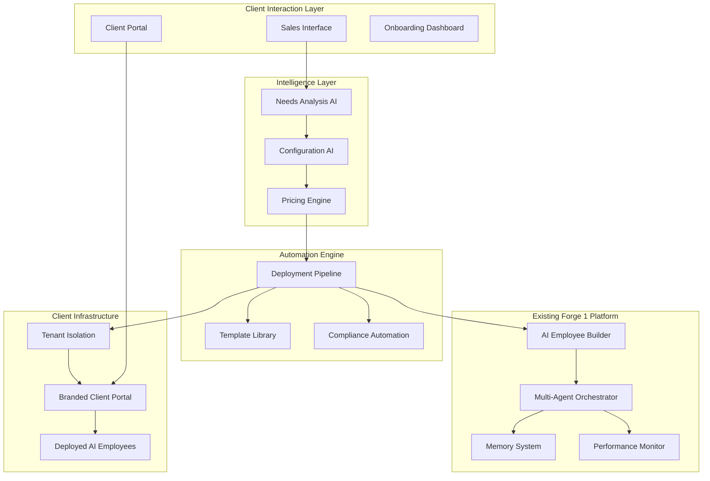

# Client Onboarding Automation Design Document

## Overview

The Client Onboarding Automation system extends the Forge 1 platform with intelligent client discovery, automated AI employee provisioning, and seamless deployment capabilities. This system transforms the manual sales-to-deployment process into an automated pipeline that can provision industry-specific AI employees (like AI lawyers) within hours of client confirmation.

The design leverages existing Forge 1 infrastructure while adding specialized components for client needs analysis, automated configuration, rapid deployment, and client portal integration.

## Architecture

### High-Level System Architecture



### Component Integration with Forge 1

The system integrates deeply with existing Forge 1 components:

1. **AI Employee Builder Integration**: Leverages existing builder APIs for automated configuration
2. **Template System Extension**: Extends Forge 1 templates with industry-specific configurations
3. **Orchestration Layer**: Uses existing multi-agent coordination for deployment workflows
4. **Security Framework**: Builds on existing tenant isolation and compliance systems
5. **Monitoring Integration**: Extends existing performance monitoring for client-specific metrics

## Components and Interfaces

### 1. Client Needs Analysis Engine

**Purpose**: Intelligent analysis of client conversations and requirements to determine optimal AI employee configurations

**Core Components**:
- `ConversationAnalyzer`: NLP processing of sales conversations and client communications
- `RequirementsExtractor`: Structured extraction of client needs, budget, timeline, and industry context
- `RecommendationEngine`: AI-powered recommendations for AI employee types and quantities
- `FollowUpGenerator`: Automated generation of clarifying questions for incomplete requirements

**Key Interfaces**:
```python
class ClientNeedsAnalyzer:
    def analyze_conversation(self, conversation: str, context: ClientContext) -> ClientRequirements
    def extract_requirements(self, raw_data: Dict) -> StructuredRequirements
    def recommend_ai_employees(self, requirements: ClientRequirements) -> List[AIEmployeeRecommendation]
    def generate_followup_questions(self, incomplete_reqs: ClientRequirements) -> List[Question]
```

**Integration Points**:
- Connects to Forge 1 template library for recommendation matching
- Uses existing AI models for conversation analysis
- Integrates with CRM systems for client context

### 2. Automated Configuration Engine

**Purpose**: Automatic configuration of AI employees based on analyzed client requirements

**Core Components**:
- `TemplateSelector`: Intelligent selection of appropriate AI employee templates
- `ConfigurationOptimizer`: Budget-aware optimization of AI employee capabilities
- `SkillsetMapper`: Mapping of client needs to specific AI employee skills and tools
- `ComplianceConfigurator`: Automatic application of industry-specific compliance settings

**Key Interfaces**:
```python
class AutoConfigurationEngine:
    def select_templates(self, requirements: ClientRequirements) -> List[EmployeeTemplate]
    def optimize_configuration(self, templates: List[EmployeeTemplate], budget: Budget) -> OptimizedConfig
    def map_skills_to_needs(self, client_needs: List[Need]) -> List[SkillConfiguration]
    def apply_compliance_settings(self, config: EmployeeConfig, industry: Industry) -> ComplianceConfig
```

**Integration Points**:
- Extends Forge 1 AI Employee Builder APIs
- Uses existing template system with industry-specific enhancements
- Integrates with compliance and security frameworks

### 3. Rapid Deployment Pipeline

**Purpose**: Automated deployment of configured AI employees to client environments

**Core Components**:
- `DeploymentOrchestrator`: Manages the entire deployment workflow
- `TenantProvisioner`: Creates isolated client environments with appropriate security
- `ValidationEngine`: Comprehensive testing of deployed AI employees
- `RollbackManager`: Automatic rollback capabilities for failed deployments

**Key Interfaces**:
```python
class DeploymentPipeline:
    def initiate_deployment(self, config: ClientConfiguration) -> DeploymentJob
    def provision_tenant(self, client: Client) -> TenantEnvironment
    def deploy_ai_employees(self, employees: List[AIEmployee], tenant: TenantEnvironment) -> DeploymentResult
    def validate_deployment(self, deployment: DeploymentResult) -> ValidationReport
    def rollback_if_failed(self, deployment: DeploymentResult) -> RollbackResult
```

**Integration Points**:
- Uses Forge 1 orchestration engine for deployment workflows
- Leverages existing Kubernetes infrastructure for tenant provisioning
- Integrates with monitoring systems for deployment validation

### 4. Industry-Specific Template Library

**Purpose**: Comprehensive library of pre-configured AI employee templates for different industries

**Core Components**:
- `LegalTemplates`: Specialized templates for legal industry (litigation support, contract review, legal research, compliance)
- `HealthcareTemplates`: Healthcare-specific templates (medical research, patient communication, administrative tasks)
- `FinancialTemplates`: Financial services templates (risk analysis, compliance, client communication, modeling)
- `TemplateManager`: Management and versioning of template library

**Template Structure**:
```python
class IndustryTemplate:
    industry: Industry
    role_type: RoleType
    base_capabilities: List[Capability]
    required_tools: List[Tool]
    compliance_requirements: List[ComplianceRule]
    performance_benchmarks: PerformanceBenchmark
    customization_options: List[CustomizationOption]
```

**Legal AI Employee Templates**:
- **Litigation Support AI**: Case research, document discovery, legal precedent analysis
- **Contract Review AI**: Contract analysis, risk assessment, clause recommendations
- **Legal Research AI**: Legal database queries, case law analysis, regulatory research
- **Compliance Monitor AI**: Regulatory tracking, compliance reporting, risk monitoring

### 5. Client Portal Integration System

**Purpose**: Seamless integration of AI employees into branded client portals

**Core Components**:
- `PortalCustomizer`: Client-specific branding and customization
- `AccessManager`: User authentication and permission management
- `InterfaceGenerator`: Dynamic generation of client-specific interfaces
- `IntegrationBridge`: Connection between client systems and AI employees

**Key Interfaces**:
```python
class ClientPortalSystem:
    def create_branded_portal(self, client: Client, branding: BrandingConfig) -> ClientPortal
    def setup_user_access(self, portal: ClientPortal, users: List[User]) -> AccessConfiguration
    def generate_interfaces(self, ai_employees: List[AIEmployee]) -> List[UserInterface]
    def integrate_with_client_systems(self, portal: ClientPortal, integrations: List[Integration]) -> IntegrationResult
```

**Integration Points**:
- Extends Forge 1 dashboard framework with client-specific customizations
- Uses existing authentication and authorization systems
- Integrates with client's existing systems and workflows

### 6. Automated Pricing and Contract Engine

**Purpose**: Dynamic pricing calculation and contract generation based on client configurations

**Core Components**:
- `PricingCalculator`: Dynamic pricing based on AI employee types, quantities, and service levels
- `ValueAnalyzer`: ROI calculation and value proposition generation
- `ContractGenerator`: Automated generation of service agreements and SLAs
- `NegotiationSupport`: Alternative configurations for different budget scenarios

**Pricing Model**:
```python
class PricingEngine:
    def calculate_base_pricing(self, ai_employees: List[AIEmployee]) -> BasePricing
    def apply_volume_discounts(self, pricing: BasePricing, quantity: int) -> DiscountedPricing
    def calculate_roi_metrics(self, pricing: Pricing, human_baseline: HumanCosts) -> ROIAnalysis
    def generate_contract_terms(self, pricing: Pricing, sla_requirements: SLARequirements) -> ContractTerms
```

## Data Models

### Core Data Models

```python
# Client Requirements Model
@dataclass
class ClientRequirements:
    client_id: str
    industry: Industry
    budget_range: BudgetRange
    timeline: Timeline
    required_roles: List[RoleRequirement]
    compliance_needs: List[ComplianceRequirement]
    integration_requirements: List[IntegrationRequirement]
    performance_expectations: PerformanceExpectations

# AI Employee Configuration Model
@dataclass
class AIEmployeeConfiguration:
    template_id: str
    role_type: RoleType
    capabilities: List[Capability]
    tools: List[Tool]
    compliance_settings: ComplianceConfiguration
    performance_targets: PerformanceTargets
    customizations: List[Customization]

# Deployment Configuration Model
@dataclass
class DeploymentConfiguration:
    client_id: str
    ai_employees: List[AIEmployeeConfiguration]
    tenant_settings: TenantConfiguration
    security_settings: SecurityConfiguration
    integration_settings: List[IntegrationConfiguration]
    monitoring_settings: MonitoringConfiguration

# Client Portal Configuration Model
@dataclass
class ClientPortalConfiguration:
    client_id: str
    branding: BrandingConfiguration
    user_access: List[UserAccessConfiguration]
    interface_customizations: List[InterfaceCustomization]
    integration_endpoints: List[EndpointConfiguration]
```

### Industry-Specific Models

```python
# Legal Industry Models
@dataclass
class LegalAIEmployee:
    specialization: LegalSpecialization  # litigation, contracts, research, compliance
    bar_jurisdictions: List[Jurisdiction]
    legal_databases: List[LegalDatabase]
    confidentiality_level: ConfidentialityLevel
    attorney_client_privilege: bool

# Healthcare Industry Models
@dataclass
class HealthcareAIEmployee:
    medical_specialization: MedicalSpecialization
    hipaa_compliance: HIPAAConfiguration
    medical_databases: List[MedicalDatabase]
    patient_interaction_level: PatientInteractionLevel
    clinical_decision_support: bool

# Financial Services Models
@dataclass
class FinancialAIEmployee:
    financial_specialization: FinancialSpecialization
    regulatory_compliance: List[FinancialRegulation]
    risk_management_level: RiskManagementLevel
    client_data_access: ClientDataAccessLevel
    trading_capabilities: bool
```

## Error Handling

### Comprehensive Error Management

1. **Client Analysis Errors**
   - Incomplete or ambiguous client requirements
   - Budget constraints that don't match requirements
   - Industry-specific compliance conflicts

2. **Configuration Errors**
   - Template compatibility issues
   - Resource allocation conflicts
   - Compliance requirement violations

3. **Deployment Errors**
   - Infrastructure provisioning failures
   - AI employee initialization problems
   - Integration connectivity issues

4. **Client Portal Errors**
   - Authentication and authorization failures
   - Customization conflicts
   - Performance degradation issues

```python
class OnboardingErrorHandler:
    def handle_analysis_error(self, error: AnalysisError, context: ClientContext) -> ErrorResolution:
        if isinstance(error, IncompleteRequirementsError):
            return self.generate_followup_questions(error.missing_fields)
        elif isinstance(error, BudgetConstraintError):
            return self.suggest_alternative_configurations(error.budget, error.requirements)
        else:
            return self.escalate_to_human_analyst(error, context)
    
    def handle_deployment_error(self, error: DeploymentError, deployment: DeploymentJob) -> ErrorResolution:
        if isinstance(error, InfrastructureError):
            return self.retry_with_alternative_resources(deployment)
        elif isinstance(error, ValidationError):
            return self.rollback_and_reconfigure(deployment, error.validation_failures)
        else:
            return self.escalate_to_operations_team(error, deployment)
```

## Testing Strategy

### Multi-Layer Testing Approach

1. **Unit Testing**
   - Individual component functionality
   - Template configuration validation
   - Pricing calculation accuracy
   - Compliance rule application

2. **Integration Testing**
   - End-to-end onboarding workflow
   - Forge 1 platform integration
   - Client portal functionality
   - AI employee deployment validation

3. **Industry-Specific Testing**
   - Legal AI employee capabilities and compliance
   - Healthcare HIPAA compliance and functionality
   - Financial services regulatory compliance
   - Cross-industry template compatibility

4. **Performance Testing**
   - Rapid deployment timeline validation (target: <4 hours)
   - Concurrent client onboarding capacity
   - AI employee performance benchmarking
   - Client portal responsiveness under load

5. **Security and Compliance Testing**
   - Tenant isolation validation
   - Industry-specific compliance verification
   - Data privacy and encryption testing
   - Access control and authentication testing

```python
class OnboardingTestSuite:
    def test_legal_client_onboarding(self):
        # Test complete flow: law firm discovery -> AI lawyer deployment
        client_reqs = self.create_legal_client_requirements()
        config = self.analyzer.analyze_requirements(client_reqs)
        deployment = self.pipeline.deploy_ai_employees(config)
        
        assert deployment.success
        assert deployment.time_to_complete < timedelta(hours=4)
        assert all(emp.compliance.attorney_client_privilege for emp in deployment.ai_employees)
    
    def test_rapid_deployment_performance(self):
        # Test deployment speed and reliability
        configs = self.generate_test_configurations(count=10)
        start_time = time.time()
        
        deployments = [self.pipeline.deploy_ai_employees(config) for config in configs]
        
        total_time = time.time() - start_time
        assert total_time < 3600  # All deployments within 1 hour
        assert all(d.success for d in deployments)
```

## Security and Compliance

### Industry-Specific Compliance Automation

1. **Legal Industry Compliance**
   - Attorney-client privilege protection
   - Legal hold and discovery management
   - Bar association ethical compliance
   - Confidentiality and conflict checking

2. **Healthcare Compliance**
   - HIPAA privacy and security rules
   - Patient data encryption and access controls
   - Medical record retention policies
   - Clinical decision support guidelines

3. **Financial Services Compliance**
   - SOX financial reporting requirements
   - SEC regulatory compliance
   - PCI DSS payment data security
   - Anti-money laundering (AML) monitoring

```python
class ComplianceAutomation:
    def configure_legal_compliance(self, ai_employee: LegalAIEmployee, client: LegalClient):
        # Automatic attorney-client privilege configuration
        ai_employee.enable_privilege_protection()
        ai_employee.configure_conflict_checking(client.existing_clients)
        ai_employee.set_confidentiality_level(ConfidentialityLevel.ATTORNEY_CLIENT)
        
        # Legal hold and discovery capabilities
        ai_employee.enable_legal_hold_management()
        ai_employee.configure_discovery_protocols(client.jurisdiction_rules)
    
    def configure_healthcare_compliance(self, ai_employee: HealthcareAIEmployee, client: HealthcareClient):
        # HIPAA compliance automation
        ai_employee.enable_hipaa_compliance()
        ai_employee.configure_patient_data_encryption()
        ai_employee.set_minimum_necessary_access()
        
        # Clinical decision support safeguards
        if ai_employee.clinical_decision_support:
            ai_employee.enable_clinical_safeguards()
            ai_employee.require_physician_oversight()
```

## Performance Optimization

### Rapid Deployment Optimization

1. **Template Pre-warming**
   - Pre-configured AI employee templates ready for instant deployment
   - Cached model weights and configurations
   - Pre-provisioned infrastructure resources

2. **Parallel Processing**
   - Concurrent AI employee configuration and deployment
   - Parallel compliance validation and security setup
   - Asynchronous client portal customization

3. **Intelligent Resource Allocation**
   - Dynamic resource scaling based on deployment requirements
   - Predictive resource provisioning for anticipated demand
   - Efficient resource sharing across client tenants

```python
class DeploymentOptimizer:
    def optimize_deployment_speed(self, deployment_config: DeploymentConfiguration):
        # Pre-warm templates and resources
        templates = self.pre_warm_templates(deployment_config.ai_employees)
        resources = self.pre_provision_resources(deployment_config.resource_requirements)
        
        # Parallel deployment execution
        deployment_tasks = [
            self.deploy_ai_employee_async(emp, resources) 
            for emp in deployment_config.ai_employees
        ]
        
        # Concurrent portal setup
        portal_task = self.setup_client_portal_async(deployment_config.portal_config)
        
        # Wait for all tasks to complete
        return self.wait_for_completion([*deployment_tasks, portal_task])
```

This design provides a comprehensive foundation for automating the client onboarding process, from initial needs analysis through rapid AI employee deployment, while maintaining the high standards of performance, security, and compliance required for enterprise clients.