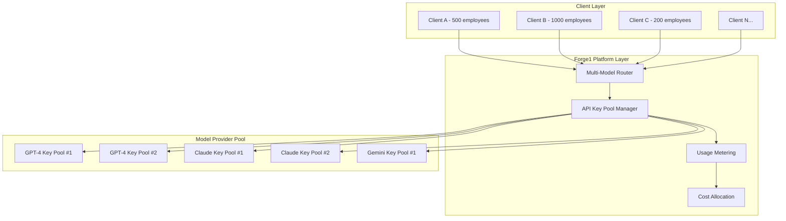

# Forge1 Platform: Comprehensive Multi-Tenant AI Employee System Design

## Overview

This comprehensive design document combines the multi-tenant model management, isolation architecture, and implementation roadmap for the Forge1 platform. Forge1 is an enterprise-grade AI Employee Factory that efficiently manages API keys and model access for 8-10 AI models (GPT-4o/5, Claude, Gemini, etc.) across hundreds or thousands of enterprise clients while maintaining cost control, security, performance, and compliance.

## Table of Contents

1. [Multi-Tenant Model Management Architecture](#multi-tenant-model-management-architecture)
2. [Tenant Isolation and Security Design](#tenant-isolation-and-security-design)
3. [Implementation Roadmap](#implementation-roadmap)
4. [Cross-Cutting Concerns](#cross-cutting-concerns)
5. [Deployment and Operations](#deployment-and-operations)

---

## Multi-Tenant Model Management Architecture

### 1. **Pooled API Key Management with Client Isolation**

Instead of requiring each client to provide their own API keys, Forge1 uses a **pooled resource model** with intelligent routing and cost allocation:



### 2. **API Key Pool Architecture**

#### Pool Configuration
```python
class ModelKeyPool:
    def __init__(self, model_provider: str):
        self.provider = model_provider
        self.active_keys = []
        self.backup_keys = []
        self.rate_limits = {}
        self.usage_tracking = {}
        self.cost_per_token = {}
        
    async def get_optimal_key(self, client_id: str, request_size: int) -> APIKey:
        """Select best available key based on rate limits and client priority"""
        
class APIKeyManager:
    def __init__(self):
        self.pools = {
            "openai": [ModelKeyPool("openai") for _ in range(5)],  # 5 OpenAI accounts
            "anthropic": [ModelKeyPool("anthropic") for _ in range(3)],  # 3 Claude accounts
            "google": [ModelKeyPool("google") for _ in range(2)],  # 2 Gemini accounts
        }
```

### 3. **Client Tier-Based Resource Allocation**

#### Tier Structure
- **Enterprise Tier ($200K+/month)**: Dedicated key pools, priority routing, guaranteed capacity
- **Professional Tier ($50K-200K/month)**: Shared pools with priority access
- **Standard Tier (<$50K/month)**: Shared pools with standard access

```python
class ClientTier(Enum):
    ENTERPRISE = "enterprise"  # Dedicated resources
    PROFESSIONAL = "professional"  # Priority shared
    STANDARD = "standard"  # Standard shared

class ResourceAllocation:
    def __init__(self):
        self.tier_allocations = {
            ClientTier.ENTERPRISE: {
                "dedicated_keys": True,
                "rate_limit_multiplier": 5.0,
                "priority_score": 100,
                "guaranteed_capacity": 0.8  # 80% of key capacity reserved
            },
            ClientTier.PROFESSIONAL: {
                "dedicated_keys": False,
                "rate_limit_multiplier": 2.0,
                "priority_score": 50,
                "guaranteed_capacity": 0.4
            },
            ClientTier.STANDARD: {
                "dedicated_keys": False,
                "rate_limit_multiplier": 1.0,
                "priority_score": 10,
                "guaranteed_capacity": 0.1
            }
        }
```

### 4. **Intelligent Request Routing**

#### Smart Load Balancing
```python
class ModelRouter:
    async def route_request(self, client_request: ModelRequest) -> ModelResponse:
        # 1. Determine client tier and priority
        client_tier = await self.get_client_tier(client_request.client_id)
        
        # 2. Analyze request requirements
        optimal_model = await self.select_optimal_model(
            task_complexity=client_request.complexity,
            client_tier=client_tier,
            cost_constraints=client_request.budget_limits
        )
        
        # 3. Get available API key from pool
        api_key = await self.key_manager.get_optimal_key(
            model=optimal_model,
            client_id=client_request.client_id,
            tier=client_tier
        )
        
        # 4. Execute request with usage tracking
        response = await self.execute_with_tracking(
            request=client_request,
            api_key=api_key,
            model=optimal_model
        )
        
        return response
```

### 5. **Cost Management Strategies**

#### Dynamic Pricing Model
```python
class CostOptimizer:
    def __init__(self):
        self.model_costs = {
            "gpt-4": {"input": 0.03, "output": 0.06},  # per 1K tokens
            "gpt-4-turbo": {"input": 0.01, "output": 0.03},
            "claude-3": {"input": 0.015, "output": 0.075},
            "gemini-pro": {"input": 0.0005, "output": 0.0015}
        }
        
    async def optimize_model_selection(self, task: Task, budget: float) -> str:
        """Select most cost-effective model for task requirements"""
        
        # Calculate cost-performance ratio for each model
        model_scores = {}
        for model, costs in self.model_costs.items():
            estimated_tokens = self.estimate_tokens(task)
            estimated_cost = (estimated_tokens * costs["input"]) / 1000
            performance_score = self.get_model_performance(model, task.complexity)
            
            model_scores[model] = {
                "cost": estimated_cost,
                "performance": performance_score,
                "cost_efficiency": performance_score / estimated_cost
            }
        
        # Select best cost-efficient model within budget
        return max(model_scores.items(), 
                  key=lambda x: x[1]["cost_efficiency"] if x[1]["cost"] <= budget else 0)[0]
```

---

## Tenant Isolation and Security Design

### 1. **Request Context Isolation Layer**

```python
class RequestContext:
    """Enhanced request context with complete isolation"""
    
    def __init__(self):
        self.tenant_id: str = None
        self.client_id: str = None
        self.employee_id: str = None
        self.session_id: str = None
        self.user_id: str = None
        self.request_id: str = str(uuid.uuid4())
        self.created_at: datetime = datetime.utcnow()
        
        # Billing context
        self.billing_context = BillingContext()
        
        # Security context
        self.security_level: SecurityLevel = SecurityLevel.INTERNAL
        self.data_classification: str = "internal"
        
        # Performance tracking
        self.performance_metrics = PerformanceMetrics()

class ContextManager:
    """Thread-safe context management with complete isolation"""
    
    def __init__(self):
        self._context_storage = contextvars.ContextVar('request_context')
        self._context_stack = []
    
    def set_context(self, context: RequestContext) -> None:
        """Set request context with validation"""
        if not context.tenant_id or not context.client_id:
            raise ValueError("Tenant ID and Client ID are required")
        
        # Validate context integrity
        self._validate_context(context)
        
        # Set in context variable (thread-safe)
        self._context_storage.set(context)
        
        # Add to stack for nested contexts
        self._context_stack.append(context)
```

### 2. **Enhanced Memory Isolation System**

```python
class IsolatedMemoryManager(MemoryManager):
    """Memory manager with enhanced tenant isolation"""
    
    async def store_memory(self, memory: MemoryContext) -> str:
        """Store memory with strict tenant isolation"""
        
        # Get current context
        context = context_manager.get_context()
        
        # Enforce tenant isolation
        memory = self._enforce_tenant_isolation(memory, context)
        
        # Add isolation metadata
        memory.metadata = {
            **memory.metadata,
            'tenant_id': context.tenant_id,
            'client_id': context.client_id,
            'employee_id': context.employee_id,
            'isolation_level': 'strict',
            'created_by_request': context.request_id
        }
        
        # Store with tenant-specific encryption
        encrypted_memory = await self._encrypt_for_tenant(memory, context.tenant_id)
        
        return await super().store_memory(encrypted_memory)
    
    def _enforce_tenant_isolation(self, memory: MemoryContext, context: RequestContext) -> MemoryContext:
        """Enforce strict tenant isolation on memory"""
        
        # Add tenant tags
        tenant_tags = [
            f"tenant:{context.tenant_id}",
            f"client:{context.client_id}",
            f"employee:{context.employee_id}"
        ]
        
        for tag in tenant_tags:
            if tag not in memory.tags:
                memory.tags.append(tag)
        
        # Set owner to tenant-scoped user
        memory.owner_id = f"{context.tenant_id}:{context.user_id}"
        
        return memory
```

### 3. **API Call Tracking and Attribution System**

```python
class APICallTracker:
    """Track and attribute API calls to specific tenants/employees"""
    
    async def track_api_call(
        self,
        provider: str,
        model: str,
        input_tokens: int,
        output_tokens: int,
        response_time_ms: float,
        cost: Decimal
    ) -> str:
        """Track API call with complete attribution"""
        
        # Get current context
        context = context_manager.get_context()
        
        # Generate tracking ID
        call_id = f"api_{context.tenant_id}_{context.employee_id}_{int(time.time() * 1000)}"
        
        # Create detailed call record
        call_record = APICallRecord(
            call_id=call_id,
            tenant_id=context.tenant_id,
            client_id=context.client_id,
            employee_id=context.employee_id,
            provider=provider,
            model=model,
            input_tokens=input_tokens,
            output_tokens=output_tokens,
            cost=cost,
            timestamp=datetime.utcnow()
        )
        
        # Store and bill
        await self._store_call_record(call_record)
        await self.billing_engine.record_usage(
            customer_id=context.client_id,
            metric_id="ai_tokens",
            quantity=Decimal(str(input_tokens + output_tokens)),
            metadata={'call_id': call_id, 'provider': provider, 'model': model}
        )
        
        return call_id
```

### 4. **Database Schema for Isolation**

```sql
-- Enhanced tenant isolation tables
CREATE SCHEMA IF NOT EXISTS forge1_isolation;

-- API call tracking table
CREATE TABLE forge1_isolation.api_call_records (
    call_id VARCHAR(255) PRIMARY KEY,
    tenant_id VARCHAR(255) NOT NULL,
    client_id VARCHAR(255) NOT NULL,
    employee_id UUID NOT NULL,
    session_id UUID,
    user_id VARCHAR(255) NOT NULL,
    request_id VARCHAR(255) NOT NULL,
    
    -- API details
    provider VARCHAR(50) NOT NULL,
    model VARCHAR(100) NOT NULL,
    input_tokens INTEGER NOT NULL,
    output_tokens INTEGER NOT NULL,
    total_tokens INTEGER NOT NULL,
    response_time_ms FLOAT NOT NULL,
    cost DECIMAL(10,6) NOT NULL,
    
    -- Timing
    timestamp TIMESTAMP WITH TIME ZONE NOT NULL,
    billing_period VARCHAR(20) NOT NULL,
    
    created_at TIMESTAMP WITH TIME ZONE DEFAULT NOW()
);

-- Tenant encryption keys table
CREATE TABLE forge1_isolation.tenant_encryption_keys (
    tenant_id VARCHAR(255) PRIMARY KEY,
    encryption_key_hash VARCHAR(255) NOT NULL,
    key_version INTEGER NOT NULL DEFAULT 1,
    created_at TIMESTAMP WITH TIME ZONE DEFAULT NOW(),
    rotated_at TIMESTAMP WITH TIME ZONE,
    expires_at TIMESTAMP WITH TIME ZONE
);

-- Indexes for performance
CREATE INDEX idx_api_calls_tenant_time ON forge1_isolation.api_call_records(tenant_id, timestamp);
CREATE INDEX idx_api_calls_client_billing ON forge1_isolation.api_call_records(client_id, billing_period);
CREATE INDEX idx_api_calls_employee ON forge1_isolation.api_call_records(employee_id, timestamp);
```

---

## Implementation Roadmap

### Phase 0 — Repository, Environments, and Baseline

- **Bootstrap CI/CD**
  - Add GitHub Actions workflows for: lint/test (backend/frontend), Docker build, security scan (Trivy), Helm chart lint, Terraform fmt/validate
  - **DoD**: Green pipelines on PR; artifacts for backend/frontend images published to registry
  - **Validate**: `gh run list`, verify container digests and SBOMs

- **Dev/Prod config hardening**
  - Centralize `.env` templates, pin all Docker base images, add Renovate/Bandit/Snyk config
  - **DoD**: Reproducible builds; dependency update PRs generated
  - **Validate**: `docker compose build` reproducible; Renovate runs

- **Documentation alignment**
  - Ensure README, VERIFY_LOCAL.md, Master Handbook sections match actual paths
  - **DoD**: New contributor can set up and run e2e locally in <30 minutes
  - **Validate**: Fresh machine run of `./forge1/scripts/e2e_full.sh` succeeds

### Phase 1 — Core Orchestration, Memory, and RAG

- **Durable orchestration backbone**
  - Finalize `forge1/core/orchestration.py` with retry/circuit breaker/outbox patterns
  - **DoD**: Unit tests pass, integration demo runs via API endpoint
  - **Validate**: Chaos tests simulate failures; tasks complete exactly once

- **Advanced memory layer**
  - Wire Postgres + Redis; add vector DB adapters (Pinecone, Weaviate, PgVector)
  - Implement memory CRUD, semantic search, context compression, selective sharing
  - **DoD**: `MEMORY_SYSTEM_IMPLEMENTATION.md` features covered; perf budget documented
  - **Validate**: Memory tests + retrieval quality benchmarks (NDCG/MRR) meet thresholds

- **Multi‑model router v1**
  - Extend router to expose pluggable adapters; maintain cost/perf telemetry
  - **DoD**: Supports GPT‑4o/4o‑mini, Claude 3.5, Gemini 1.5, and Open‑Source
  - **Validate**: Synthetic task matrix proves routing correctness and cost savings

### Phase 2 — AI Employee Builder UI + Tool Library

- **Employee builder UX**
  - Next.js app pages for template selection, drag‑and‑drop workflow composer
  - **DoD**: Users can create an employee config and persist to backend
  - **Validate**: Cypress/Playwright flows cover create/edit/deploy

- **Tool integration library**
  - Standardized connector SDK + prebuilt connectors: HTTP API, Webhook, n8n, Zapier
  - **DoD**: Connectors tested with sandbox accounts; secrets via Vault/KeyVault
  - **Validate**: Contract tests; error budgets and retry policies documented

- **Config-to-runtime bridge**
  - Translate saved builder configs into orchestrated multi‑agent graphs
  - **DoD**: Graphs can be executed, paused, resumed; state persisted
  - **Validate**: Scenario tests for each template vertical complete end‑to‑end jobs

### Phase 3 — Multi‑Tenant Auth, Security, and Dashboards

- **AuthN/Z & tenancy**
  - Implement JWT + OAuth2 (Auth0/Azure AD) with tenant isolation
  - RBAC (admin, manager, analyst, viewer); per‑tenant rate limits and quotas
  - **DoD**: Backend enforces tenant boundaries at data and execution layers
  - **Validate**: Pen tests for cross‑tenant access; audit trail review

- **Compliance & auditability**
  - Data classification, DLP policies, encryption at rest/in transit
  - **DoD**: SOC2/GDPR/HIPAA readiness checklist met; evidence stored
  - **Validate**: Automated compliance checks in CI; sample auditor report generation

- **Premium dashboards**
  - Real‑time performance, cost, and ROI analytics per employee/tenant
  - **DoD**: Product metrics accessible with drill‑downs; exportable reports
  - **Validate**: Backfilled metrics; correctness cross‑checked with Prometheus/Grafana

### Phase 4 — Testing Framework and Closed Beta

- **Test strategy**
  - Expand unit/integration/e2e coverage; contract tests for adapters
  - **DoD**: Coverage ≥ 80% on critical paths; SLOs defined
  - **Validate**: K6/Locust runs; failure injection proves resilience

- **Eval & benchmarking**
  - Superhuman performance validation suite (speed, accuracy, quality)
  - **DoD**: Documented superiority vs. human baselines
  - **Validate**: Periodic eval jobs write to long‑term store

- **Beta readout**
  - Pilot with 3–5 tenants across different verticals
  - **DoD**: Issues triaged, roadmap adjusted; go/no‑go for Phase 5
  - **Validate**: NPS/ROI targets met; stability within SLOs

### Phase 5 — Monitoring, Logging, and Azure AI Foundry

- **Observability stack**
  - Prometheus + Grafana for metrics; ELK/Opensearch for logs
  - **DoD**: On‑call runbooks; alerts routed; dashboards per tenant and per employee
  - **Validate**: Synthetic probes; alert tests; log retention policies enforced

- **Azure deployment**
  - AKS Helm charts; KeyVault, ACR, managed Postgres/Redis
  - **DoD**: Blue/green deploys; rollback tested; secrets managed centrally
  - **Validate**: Game days; disaster recovery drill; RPO/RTO documented

### Phase 6 — Feedback Loops and AI CEO Integration

- **Continuous improvement loops**
  - In‑product feedback capture; auto‑tuning for prompts/tools/routing
  - **DoD**: Closed‑loop improvements observable in metrics
  - **Validate**: A/B tests show uplift; rollback paths exist

- **AI CEO/overseer agent**
  - Supervisory agent for cross‑employee coordination, prioritization
  - **DoD**: Overseer optimizes throughput and cost across tenants
  - **Validate**: Scenario sims show improved completion time and cost per job

### Phase 7 — Enterprise Expansion (EaaS, Portal, Compliance)

- **API‑first EaaS**
  - Public, versioned APIs to provision/manage employees, jobs, data sources
  - **DoD**: RBAC‑scoped API keys; rate limits; audit logging
  - **Validate**: SDK contract tests; tenant‑scoped load tests

- **Enterprise portal**
  - SSO/SAML, org hierarchies, approvals, data residency controls
  - **DoD**: Enterprise onboarding guide; compliance evidence mapped to controls
  - **Validate**: Customer UAT sign‑off

---

## Cross-Cutting Concerns

### Multi‑Model Routing (Adapters)
- Include GPT‑4o/5, Claude, Gemini, DeepSeek R1, Qwen
- Define adapter interface, benchmarking harness, cost tracker, failover policy

### Async Execution
- Provide Celery + Redis path and Azure Durable Functions path behind a common abstraction
- Feature flag selection per env

### Secrets Management
- Standardize on HashiCorp Vault + Azure KeyVault
- Rotate keys; dynamic creds for DBs; no secrets in code

### Connectors
- Ship core set now (HTTP, Webhook, n8n, Zapier)
- Design stubs for Slack, Teams, Gmail, Salesforce/HubSpot, SAP/Oracle

### Security
- Static analysis, deps scanning, container scanning
- Policy as code (OPA); zero‑trust network segmentation
- Per‑tenant encryption contexts

---

## Deployment and Operations

### Acceptance Gates (Go/No‑Go)
- **Functional**: All Phase 1–3 features demonstrated with one fully functional vertical employee in production‑like env
- **Performance**: Meets "extreme workload" targets; autoscaling verified; SLOs stable for 2 weeks
- **Compliance**: SOC2/GDPR control checklist satisfied with evidence; data lifecycle policies active
- **Reliability**: Failover drills passed; RPO/RTO met; blue/green rollbacks proven
- **Security**: External pen test with critical/High findings remediated

### Milestone Checklist (Condensed)
- [ ] CI/CD and reproducible builds
- [ ] Durable orchestration E2E
- [ ] Memory + RAG quality lift verified
- [ ] Router with full adapter set
- [ ] Builder UI deploys real agents
- [ ] Tool connectors (core set)
- [ ] OAuth2/JWT multi‑tenant auth + RBAC
- [ ] Compliance/audit logging end‑to‑end
- [ ] Premium dashboards (perf, ROI, cost)
- [ ] Load/chaos tests passing with SLOs
- [ ] Observability (metrics/logs/traces)
- [ ] AKS Helm deploy with blue/green
- [ ] Feedback loops + overseer agent
- [ ] EaaS APIs + SDKs + billing hooks

## Implementation Benefits

### For Forge1 Platform:
1. **Cost Efficiency**: Bulk API key purchasing and intelligent routing reduce per-request costs
2. **Scalability**: Automatic scaling based on demand without client intervention
3. **Revenue Optimization**: Tier-based pricing maximizes revenue while controlling costs
4. **Operational Simplicity**: Centralized management reduces complexity

### For Enterprise Clients:
1. **No API Key Management**: Clients don't need to manage multiple AI provider accounts
2. **Guaranteed Performance**: SLA-backed performance guarantees based on tier
3. **Cost Predictability**: Fixed monthly pricing with usage transparency
4. **Compliance Assurance**: Built-in compliance for GDPR, HIPAA, SOX, etc.

### For AI Providers:
1. **Stable Revenue**: Forge1 provides consistent, high-volume usage
2. **Reduced Support Burden**: Single enterprise contact instead of hundreds of individual clients
3. **Better Utilization**: Intelligent routing optimizes model usage patterns

## Risk Mitigation

1. **API Key Security**: Keys stored in Azure KeyVault with rotation policies
2. **Rate Limit Management**: Intelligent queuing and fallback mechanisms
3. **Cost Control**: Real-time monitoring with automatic budget alerts
4. **Vendor Lock-in Prevention**: Multi-provider strategy ensures redundancy
5. **Compliance**: Client data isolation and audit trails for all requests

This comprehensive architecture allows Forge1 to efficiently serve hundreds or thousands of clients with a manageable set of API keys while maintaining security, performance, and cost control across all phases of development and deployment.