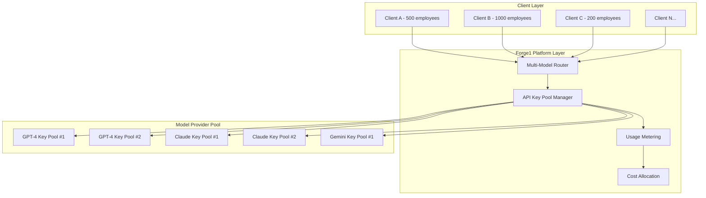

# Multi-Tenant Model Management Design

## Overview

This design addresses how Forge1 will efficiently manage API keys and model access for 8-10 AI models (GPT-4o/5, Claude, Gemini, etc.) across hundreds or thousands of enterprise clients while maintaining cost control, security, performance, and compliance.

## Architecture Strategy

### 1. **Pooled API Key Management with Client Isolation**

Instead of requiring each client to provide their own API keys, Forge1 uses a **pooled resource model** with intelligent routing and cost allocation:



### 2. **API Key Pool Architecture**

#### Pool Configuration
```python
class ModelKeyPool:
    def __init__(self, model_provider: str):
        self.provider = model_provider
        self.active_keys = []
        self.backup_keys = []
        self.rate_limits = {}
        self.usage_tracking = {}
        self.cost_per_token = {}
        
    async def get_optimal_key(self, client_id: str, request_size: int) -> APIKey:
        """Select best available key based on rate limits and client priority"""
        
class APIKeyManager:
    def __init__(self):
        self.pools = {
            "openai": [ModelKeyPool("openai") for _ in range(5)],  # 5 OpenAI accounts
            "anthropic": [ModelKeyPool("anthropic") for _ in range(3)],  # 3 Claude accounts
            "google": [ModelKeyPool("google") for _ in range(2)],  # 2 Gemini accounts
        }
```

### 3. **Client Tier-Based Resource Allocation**

#### Tier Structure
- **Enterprise Tier ($200K+/month)**: Dedicated key pools, priority routing, guaranteed capacity
- **Professional Tier ($50K-200K/month)**: Shared pools with priority access
- **Standard Tier (<$50K/month)**: Shared pools with standard access

```python
class ClientTier(Enum):
    ENTERPRISE = "enterprise"  # Dedicated resources
    PROFESSIONAL = "professional"  # Priority shared
    STANDARD = "standard"  # Standard shared

class ResourceAllocation:
    def __init__(self):
        self.tier_allocations = {
            ClientTier.ENTERPRISE: {
                "dedicated_keys": True,
                "rate_limit_multiplier": 5.0,
                "priority_score": 100,
                "guaranteed_capacity": 0.8  # 80% of key capacity reserved
            },
            ClientTier.PROFESSIONAL: {
                "dedicated_keys": False,
                "rate_limit_multiplier": 2.0,
                "priority_score": 50,
                "guaranteed_capacity": 0.4
            },
            ClientTier.STANDARD: {
                "dedicated_keys": False,
                "rate_limit_multiplier": 1.0,
                "priority_score": 10,
                "guaranteed_capacity": 0.1
            }
        }
```

### 4. **Intelligent Request Routing**

#### Smart Load Balancing
```python
class ModelRouter:
    async def route_request(self, client_request: ModelRequest) -> ModelResponse:
        # 1. Determine client tier and priority
        client_tier = await self.get_client_tier(client_request.client_id)
        
        # 2. Analyze request requirements
        optimal_model = await self.select_optimal_model(
            task_complexity=client_request.complexity,
            client_tier=client_tier,
            cost_constraints=client_request.budget_limits
        )
        
        # 3. Get available API key from pool
        api_key = await self.key_manager.get_optimal_key(
            model=optimal_model,
            client_id=client_request.client_id,
            tier=client_tier
        )
        
        # 4. Execute request with usage tracking
        response = await self.execute_with_tracking(
            request=client_request,
            api_key=api_key,
            model=optimal_model
        )
        
        return response
```

### 5. **Usage Metering and Cost Allocation**

#### Real-Time Usage Tracking
```python
class UsageMetering:
    def __init__(self):
        self.client_usage = {}  # client_id -> usage metrics
        self.model_costs = {}   # model -> cost per token/request
        
    async def track_usage(self, client_id: str, model: str, 
                         tokens_used: int, response_time: float):
        """Track usage for billing and optimization"""
        
        usage_record = {
            "timestamp": datetime.utcnow(),
            "client_id": client_id,
            "model": model,
            "tokens_input": tokens_used,
            "tokens_output": response.tokens_generated,
            "cost": self.calculate_cost(model, tokens_used),
            "response_time": response_time,
            "quality_score": response.quality_metrics
        }
        
        await self.store_usage_record(usage_record)
        await self.update_client_billing(client_id, usage_record)
```

### 6. **Cost Management Strategies**

#### Dynamic Pricing Model
```python
class CostOptimizer:
    def __init__(self):
        self.model_costs = {
            "gpt-4": {"input": 0.03, "output": 0.06},  # per 1K tokens
            "gpt-4-turbo": {"input": 0.01, "output": 0.03},
            "claude-3": {"input": 0.015, "output": 0.075},
            "gemini-pro": {"input": 0.0005, "output": 0.0015}
        }
        
    async def optimize_model_selection(self, task: Task, budget: float) -> str:
        """Select most cost-effective model for task requirements"""
        
        # Calculate cost-performance ratio for each model
        model_scores = {}
        for model, costs in self.model_costs.items():
            estimated_tokens = self.estimate_tokens(task)
            estimated_cost = (estimated_tokens * costs["input"]) / 1000
            performance_score = self.get_model_performance(model, task.complexity)
            
            model_scores[model] = {
                "cost": estimated_cost,
                "performance": performance_score,
                "cost_efficiency": performance_score / estimated_cost
            }
        
        # Select best cost-efficient model within budget
        return max(model_scores.items(), 
                  key=lambda x: x[1]["cost_efficiency"] if x[1]["cost"] <= budget else 0)[0]
```

### 7. **Security and Compliance**

#### Multi-Tenant Security
```python
class SecurityManager:
    def __init__(self):
        self.encryption_keys = {}  # client-specific encryption
        self.audit_logger = AuditLogger()
        
    async def secure_request(self, client_request: ModelRequest) -> SecureRequest:
        """Apply client-specific security and compliance"""
        
        # 1. Encrypt sensitive data with client-specific keys
        encrypted_data = await self.encrypt_client_data(
            data=client_request.content,
            client_id=client_request.client_id
        )
        
        # 2. Apply compliance filters (GDPR, HIPAA, etc.)
        compliant_request = await self.apply_compliance_filters(
            request=encrypted_data,
            client_compliance_requirements=client_request.compliance_level
        )
        
        # 3. Log for audit trail
        await self.audit_logger.log_request(
            client_id=client_request.client_id,
            request_hash=self.hash_request(compliant_request),
            compliance_level=client_request.compliance_level
        )
        
        return compliant_request
```

### 8. **Scalability and Performance**

#### Auto-Scaling Key Pools
```python
class KeyPoolScaler:
    async def monitor_and_scale(self):
        """Monitor usage and automatically scale key pools"""
        
        for provider, pools in self.key_manager.pools.items():
            # Check utilization rates
            utilization = await self.calculate_utilization(pools)
            
            if utilization > 0.8:  # 80% utilization threshold
                # Add more API keys to pool
                await self.provision_additional_keys(provider)
                
            elif utilization < 0.3:  # 30% utilization threshold
                # Consider reducing pool size to save costs
                await self.optimize_pool_size(provider)
```

### 9. **Client Onboarding and Configuration**

#### Automated Client Setup
```python
class ClientOnboarding:
    async def onboard_new_client(self, client_config: ClientConfig) -> ClientSetup:
        """Automatically configure client for multi-model access"""
        
        # 1. Determine client tier based on contract value
        tier = self.determine_tier(client_config.contract_value)
        
        # 2. Allocate resources based on tier
        resource_allocation = await self.allocate_resources(
            client_id=client_config.client_id,
            tier=tier,
            expected_usage=client_config.projected_usage
        )
        
        # 3. Configure security and compliance
        security_config = await self.setup_security(
            client_id=client_config.client_id,
            compliance_requirements=client_config.compliance_needs
        )
        
        # 4. Initialize usage tracking and billing
        billing_setup = await self.initialize_billing(
            client_id=client_config.client_id,
            tier=tier,
            pricing_model=client_config.pricing_agreement
        )
        
        return ClientSetup(
            resource_allocation=resource_allocation,
            security_config=security_config,
            billing_setup=billing_setup
        )
```

### 10. **Monitoring and Analytics**

#### Real-Time Dashboard
```python
class PlatformMonitoring:
    def __init__(self):
        self.metrics_collector = MetricsCollector()
        self.alerting_system = AlertingSystem()
        
    async def monitor_platform_health(self):
        """Monitor overall platform performance and costs"""
        
        metrics = {
            "total_requests_per_second": await self.get_rps(),
            "average_response_time": await self.get_avg_response_time(),
            "cost_per_client": await self.get_client_costs(),
            "model_utilization": await self.get_model_utilization(),
            "error_rates": await self.get_error_rates(),
            "client_satisfaction_scores": await self.get_satisfaction_metrics()
        }
        
        # Check for alerts
        await self.check_and_send_alerts(metrics)
        
        return metrics
```

## Implementation Benefits

### For Forge1 Platform:
1. **Cost Efficiency**: Bulk API key purchasing and intelligent routing reduce per-request costs
2. **Scalability**: Automatic scaling based on demand without client intervention
3. **Revenue Optimization**: Tier-based pricing maximizes revenue while controlling costs
4. **Operational Simplicity**: Centralized management reduces complexity

### For Enterprise Clients:
1. **No API Key Management**: Clients don't need to manage multiple AI provider accounts
2. **Guaranteed Performance**: SLA-backed performance guarantees based on tier
3. **Cost Predictability**: Fixed monthly pricing with usage transparency
4. **Compliance Assurance**: Built-in compliance for GDPR, HIPAA, SOX, etc.

### For AI Providers:
1. **Stable Revenue**: Forge1 provides consistent, high-volume usage
2. **Reduced Support Burden**: Single enterprise contact instead of hundreds of individual clients
3. **Better Utilization**: Intelligent routing optimizes model usage patterns

## Risk Mitigation

1. **API Key Security**: Keys stored in Azure KeyVault with rotation policies
2. **Rate Limit Management**: Intelligent queuing and fallback mechanisms
3. **Cost Control**: Real-time monitoring with automatic budget alerts
4. **Vendor Lock-in Prevention**: Multi-provider strategy ensures redundancy
5. **Compliance**: Client data isolation and audit trails for all requests

This architecture allows Forge1 to efficiently serve hundreds or thousands of clients with a manageable set of API keys while maintaining security, performance, and cost control.  