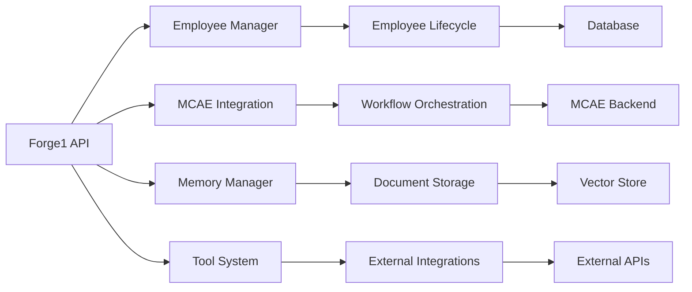

# Design Document

## Overview

This document outlines the design for verifying Forge1's client readiness through a comprehensive law firm scenario simulation. The verification will test all critical platform features end-to-end using "Hartwell & Associates" as a representative enterprise client, ensuring the platform can handle real-world multi-employee workflows with proper tenant isolation, orchestration, and reporting.

## Architecture

### Simulation Architecture

```mermaid
graph TB
    A[Law Firm Scenario Simulator] --> B[Tenant Setup]
    A --> C[Employee Creation]
    A --> D[Document Upload]
    A --> E[Workflow Execution]
    A --> F[Feature Verification]
    
    B --> B1[Create Hartwell & Associates Tenant]
    B --> B2[Configure Security Policies]
    B --> B3[Set Up Billing]
    
    C --> C1[Alexandra Corporate - Lawyer]
    C --> C2[Jordan Research - Researcher]
    C --> C3[Taylor People - HR]
    C --> C4[Morgan Intake - Intake Specialist]
    
    D --> D1[Contract Templates]
    D --> D2[HR Policies]
    D --> D3[Case Law Database]
    
    E --> E1[Client Intake Process]
    E --> E2[NDA Drafting Workflow]
    E --> E3[Research & Precedent]
    E --> E4[Document Delivery]
    E --> E5[HR Policy Queries]
    
    F --> F1[Feature Checklist Verification]
    F --> F2[Gap Analysis]
    F --> F3[Recommendations]
```



### Component Integration



## Components and Interfaces

### 1. Scenario Simulator

**Purpose**: Orchestrate the complete law firm scenario simulation

**Key Components**:
- `LawFirmScenarioSimulator`: Main orchestrator class
- `TenantSetupManager`: Handle tenant creation and configuration
- `EmployeeCreationManager`: Create and configure AI employees
- `WorkflowExecutionManager`: Execute multi-agent workflows
- `FeatureVerificationManager`: Verify feature completeness

**Interfaces**:
```python
class LawFirmScenarioSimulator:
    async def run_complete_simulation() -> SimulationResult
    async def setup_tenant() -> TenantSetupResult
    async def create_employees() -> EmployeeCreationResult
    async def upload_documents() -> DocumentUploadResult
    async def execute_workflows() -> WorkflowExecutionResult
    async def verify_features() -> FeatureVerificationResult
```

### 2. Feature Verification System

**Purpose**: Systematically verify each required feature against the implementation

**Key Components**:
- `FeatureChecker`: Base class for feature verification
- `EmployeeLifecycleChecker`: Verify employee management features
- `OrchestrationChecker`: Verify MCAE integration and workflows
- `SecurityChecker`: Verify tenant isolation and security
- `ToolChecker`: Verify tool integration and execution
- `DashboardChecker`: Verify dashboard and reporting features

**Interfaces**:
```python
class FeatureChecker:
    async def verify_feature() -> FeatureVerificationResult
    def get_feature_status() -> FeatureStatus  # ✅ implemented, ⚠️ partial, ❌ missing
    def get_gap_analysis() -> List[Gap]
    def get_recommendations() -> List[Recommendation]
```

### 3. Workflow Simulation Engine

**Purpose**: Execute realistic multi-agent workflows that mirror real law firm operations

**Key Components**:
- `ClientIntakeWorkflow`: Simulate client intake process
- `NDADraftingWorkflow`: Simulate NDA creation and review
- `ResearchWorkflow`: Simulate legal research and precedent finding
- `DocumentDeliveryWorkflow`: Simulate document delivery to clients
- `HRQueryWorkflow`: Simulate HR policy questions and responses

**Interfaces**:
```python
class WorkflowSimulator:
    async def execute_workflow(workflow_type: str, context: Dict) -> WorkflowResult
    async def verify_handoffs() -> HandoffVerificationResult
    async def check_context_preservation() -> ContextVerificationResult
    async def validate_outputs() -> OutputValidationResult
```

## Data Models

### Simulation Models

```python
@dataclass
class SimulationResult:
    tenant_setup: TenantSetupResult
    employee_creation: EmployeeCreationResult
    document_upload: DocumentUploadResult
    workflow_execution: WorkflowExecutionResult
    feature_verification: FeatureVerificationResult
    overall_status: str
    execution_time: float
    recommendations: List[str]

@dataclass
class FeatureVerificationResult:
    feature_name: str
    status: FeatureStatus  # ✅ implemented, ⚠️ partial, ❌ missing
    implementation_details: Dict[str, Any]
    gaps: List[Gap]
    file_references: List[str]
    recommendations: List[str]

@dataclass
class Gap:
    component: str
    description: str
    severity: str  # critical, high, medium, low
    file_path: Optional[str]
    implementation_required: bool
```

### Law Firm Entities

```python
@dataclass
class LawFirmEmployee:
    name: str
    role: str
    specialization: str
    tools_needed: List[str]
    knowledge_access: List[str]
    workflow_capabilities: List[str]

@dataclass
class LegalDocument:
    title: str
    document_type: str
    content: str
    access_level: str
    tags: List[str]
```

## Error Handling

### Simulation Error Recovery

1. **Tenant Setup Failures**: Retry with different configurations
2. **Employee Creation Failures**: Continue with available employees
3. **Workflow Execution Failures**: Capture detailed error information
4. **Feature Verification Failures**: Mark as inconclusive rather than missing

### Error Reporting

```python
class SimulationError(Exception):
    def __init__(self, component: str, operation: str, details: str):
        self.component = component
        self.operation = operation
        self.details = details
        super().__init__(f"{component}.{operation}: {details}")
```

## Testing Strategy

### Unit Testing

- Test individual feature checkers
- Test workflow simulators in isolation
- Test data model validation
- Test error handling scenarios

### Integration Testing

- Test complete scenario simulation
- Test MCAE integration workflows
- Test tenant isolation verification
- Test multi-employee coordination

### Performance Testing

- Measure simulation execution time
- Test concurrent employee operations
- Verify memory usage during simulation
- Test scalability with multiple tenants

## Security Considerations

### Tenant Isolation Verification

1. **Data Separation**: Verify no cross-tenant data access
2. **Memory Isolation**: Verify employee memory namespacing
3. **Workflow Isolation**: Verify MCAE workflow separation
4. **Tool Access Control**: Verify role-based tool permissions

### Audit Trail Verification

1. **Action Logging**: Verify all operations are logged
2. **Access Tracking**: Verify document access is tracked
3. **Workflow Tracing**: Verify workflow steps are auditable
4. **Security Events**: Verify security violations are logged

## Monitoring and Observability

### Simulation Metrics

- Feature verification completion rate
- Workflow execution success rate
- Employee creation success rate
- Document upload success rate
- Overall simulation health score

### Performance Metrics

- Average workflow execution time
- Memory usage per employee
- API response times
- Database query performance

### Alerting

- Critical feature gaps detected
- Simulation failures
- Performance degradation
- Security violations during testing

## Deployment Considerations

### Environment Requirements

- Access to Forge1 backend services
- Access to MCAE backend services
- Database connectivity
- External API access (for tool testing)

### Configuration Management

- Environment-specific settings
- Feature flags for optional components
- Test data management
- Cleanup procedures

## Future Enhancements

### Extended Scenarios

1. **Multi-Tenant Simulation**: Test multiple law firms simultaneously
2. **Compliance Scenarios**: Test GDPR, HIPAA compliance features
3. **Disaster Recovery**: Test backup and recovery procedures
4. **Load Testing**: Test platform under high load

### Advanced Verification

1. **AI Quality Assessment**: Verify AI response quality
2. **Workflow Optimization**: Identify workflow bottlenecks
3. **Cost Analysis**: Verify billing and cost tracking
4. **User Experience**: Simulate real user interactions