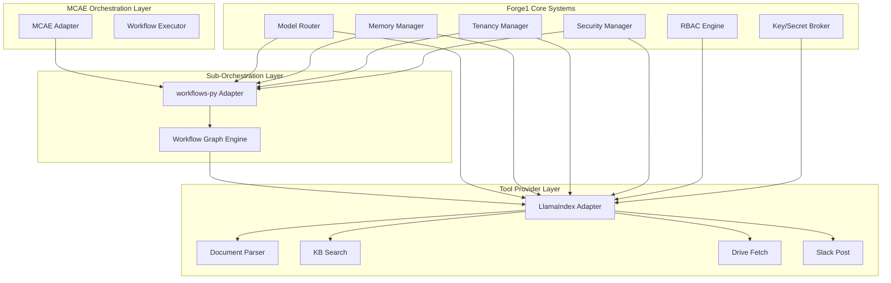
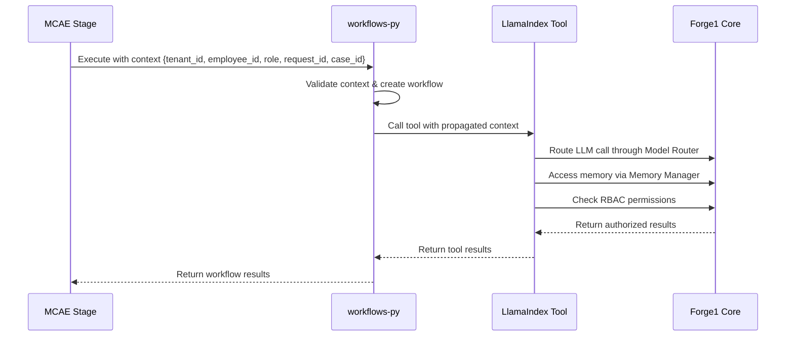

# Design Document

## Overview

This design integrates LlamaIndex and workflows-py into the Forge1 platform as first-class citizens while maintaining strict architectural boundaries. LlamaIndex serves as a tool provider for document processing, knowledge base operations, and external integrations. workflows-py provides sub-orchestration capabilities within MCAE stages for explicit step graphs. The integration preserves Forge1's tenant isolation, RBAC, memory management, and model routing as authoritative systems.

## Architecture

### High-Level Integration Architecture



### Context Propagation Flow



## Components and Interfaces

### 1. LlamaIndex Adapter (`forge1/integrations/llamaindex_adapter.py`)

**Purpose**: Provides LlamaIndex integration as a tool provider with Forge1 context awareness.

**Key Responsibilities**:
- Route all LLM/embedding calls through Forge1's Model Router
- Enforce tenant isolation and RBAC for all operations
- Provide standardized tool interfaces for MCAE and workflows-py
- Handle PII/DLP redaction before logging or persistence

**Interface**:
```python
class LlamaIndexAdapter:
    async def create_tool(self, tool_type: ToolType, config: Dict) -> LlamaIndexTool
    async def execute_tool(self, tool_id: str, context: ExecutionContext, params: Dict) -> ToolResult
    async def get_available_tools(self) -> List[ToolMetadata]
```

### 2. workflows-py Adapter (`forge1/integrations/workflows_adapter.py`)

**Purpose**: Provides workflows-py integration for sub-orchestration within MCAE stages.

**Key Responsibilities**:
- Create and execute workflow graphs with tenant/employee context
- Ensure idempotent step execution with retry/backoff
- Emit OpenTelemetry spans with proper tagging
- Maintain standardized handoff packets between steps

**Interface**:
```python
class WorkflowsAdapter:
    async def create_workflow(self, workflow_def: WorkflowDefinition, context: ExecutionContext) -> Workflow
    async def execute_workflow(self, workflow_id: str, input_data: Dict) -> WorkflowResult
    async def get_workflow_status(self, workflow_id: str) -> WorkflowStatus
```

### 3. Forge1 Model Client Shim (`forge1/integrations/llamaindex_model_shim.py`)

**Purpose**: Provides LlamaIndex-compatible model client that delegates to Forge1's Model Router.

**Key Responsibilities**:
- Implement LlamaIndex LLM interface
- Route all calls through Forge1's model selection logic
- Preserve tenant/employee context in model calls
- Track usage metrics for billing

**Interface**:
```python
class Forge1ModelShim(BaseLLM):
    async def acomplete(self, prompt: str, **kwargs) -> CompletionResponse
    async def achat(self, messages: List[ChatMessage], **kwargs) -> ChatResponse
    async def astream_complete(self, prompt: str, **kwargs) -> AsyncGenerator
```

### 4. Context-Aware Tools

#### Document Parser Tool
- **Purpose**: Parse PDF/DOCX documents with OCR fallback
- **RBAC**: Requires `document:read` permission
- **Implementation**: Uses LlamaIndex document loaders with Forge1 context

#### Knowledge Base Search Tool  
- **Purpose**: Vector/hybrid search via Forge1's vector store
- **RBAC**: Requires `knowledge_base:search` permission
- **Implementation**: Uses Forge1's memory manager for retrieval

#### Drive Fetch Tool
- **Purpose**: Read-only Google Drive access
- **RBAC**: Requires `drive:read` permission  
- **Implementation**: Uses tenant-scoped credentials from Key/Secret broker

#### Slack Post Tool
- **Purpose**: Post to tenant-scoped Slack channels
- **RBAC**: Requires `slack:post` permission
- **Implementation**: Uses tenant-specific Slack tokens

### 5. NDA Workflow Implementation

**Workflow Definition** (using workflows-py):
```python
@workflow
class NDAWorkflow:
    @step
    async def drive_fetch(self, context: WorkflowContext) -> DriveDocument:
        # Fetch document from Google Drive
    
    @step  
    async def document_parser(self, context: WorkflowContext, doc: DriveDocument) -> ParsedDocument:
        # Parse document content
    
    @step
    async def kb_search(self, context: WorkflowContext, parsed: ParsedDocument) -> SearchResults:
        # Search knowledge base for relevant information
    
    @step
    async def compose_draft(self, context: WorkflowContext, search: SearchResults) -> DraftResponse:
        # Compose NDA response using LLM
    
    @step
    async def slack_post(self, context: WorkflowContext, draft: DraftResponse) -> PostResult:
        # Post to Slack channel
```

## Data Models

### Execution Context
```python
@dataclass
class ExecutionContext:
    tenant_id: str
    employee_id: str
    role: str
    request_id: str
    case_id: str
    session_id: Optional[str] = None
    trace_id: Optional[str] = None
```

### Handoff Packet
```python
@dataclass
class HandoffPacket:
    tenant_id: str
    employee_id: str
    case_id: str
    summary: str
    citations: List[Citation]
    attachment_refs: List[AttachmentRef]
    metadata: Dict[str, Any]
```

### Tool Result
```python
@dataclass
class ToolResult:
    success: bool
    data: Any
    error: Optional[str] = None
    usage_metrics: Optional[UsageMetrics] = None
    execution_time_ms: float = 0.0
```

### Workflow Result
```python
@dataclass
class WorkflowResult:
    workflow_id: str
    status: WorkflowStatus
    steps: List[StepResult]
    final_output: HandoffPacket
    execution_time_ms: float
    error: Optional[str] = None
```

## Error Handling

### Retry Strategy
- **Exponential Backoff**: Base delay 1s, max delay 60s, max retries 3
- **Circuit Breaker**: Open after 5 consecutive failures, half-open after 30s
- **Dead Letter Queue**: Failed workflows stored for manual review

### Error Categories
1. **Transient Errors**: Network timeouts, rate limits → Retry
2. **Permission Errors**: RBAC violations → Fail fast with audit log
3. **Data Errors**: Invalid input, parsing failures → Fail with detailed error
4. **System Errors**: Service unavailable → Circuit breaker activation

### Error Response Format
```python
@dataclass
class ErrorResponse:
    error_code: str
    error_message: str
    error_category: ErrorCategory
    retry_after: Optional[int] = None
    audit_log_id: Optional[str] = None
```

## Testing Strategy

### Unit Tests
- **Adapter Tests**: Mock Forge1 dependencies, test integration logic
- **Tool Tests**: Test individual tool functionality with mocked external services
- **Context Propagation Tests**: Verify tenant/employee context flows correctly

### Integration Tests
- **Isolation Tests**: Two tenants, two employees each → verify no cross-contamination
- **RBAC Tests**: Attempt unauthorized operations → verify 403 responses with audit logs
- **Resilience Tests**: Inject failures → verify retry/circuit breaker behavior
- **Routing Tests**: Change employee model preferences → verify router selection

### End-to-End Tests
- **NDA Workflow Test**: Complete workflow execution with real/mocked external services
- **Multi-Tenant Test**: Concurrent workflows from different tenants
- **Performance Test**: Measure latency and throughput under load

### Test Data Management
- **Tenant Isolation**: Each test uses unique tenant IDs
- **Data Cleanup**: Automatic cleanup of test data after execution
- **Mock Services**: Configurable mocks for external dependencies (Drive, Slack, etc.)

## Security Considerations

### Tenant Isolation
- All operations tagged with tenant_id
- Memory operations use tenant-prefixed namespaces
- Vector store queries filtered by tenant
- No cross-tenant data access allowed

### RBAC Integration
- Every tool call checks permissions via Forge1's RBAC engine
- Permission format: `{resource}:{action}` (e.g., `document:read`)
- Audit logs for all permission checks and violations

### PII/DLP Protection
- All tool outputs processed through redaction hooks
- Sensitive data patterns detected and masked
- No PII in logs or error messages
- Configurable redaction rules per tenant

### Secrets Management
- All credentials via Forge1's Key/Secret broker
- No hardcoded API keys or tokens
- Tenant-scoped credential isolation
- Automatic credential rotation support

## Performance Optimizations

### Caching Strategy
- **Model Response Caching**: Cache LLM responses for identical prompts (1 hour TTL)
- **Document Parsing Cache**: Cache parsed document content (24 hour TTL)
- **Knowledge Base Cache**: Cache search results for common queries (30 min TTL)

### Async Processing
- All I/O operations are async
- Concurrent execution of independent workflow steps
- Connection pooling for external services
- Batch processing for multiple documents

### Resource Management
- **Connection Limits**: Max 10 concurrent connections per external service
- **Memory Limits**: Max 100MB per workflow execution
- **Timeout Limits**: 30s per tool call, 5min per workflow
- **Rate Limiting**: Respect external service rate limits

## Observability

### OpenTelemetry Integration
- **Spans**: Every tool call and workflow step creates spans
- **Tags**: All spans tagged with tenant_id, employee_id, request_id
- **Metrics**: Custom metrics for tool usage, workflow success rates
- **Traces**: End-to-end tracing from MCAE through workflows-py to tools

### Usage Tracking
- **Model Usage**: Track tokens, latency, cost per model call
- **Tool Usage**: Track execution time, success rate per tool
- **Workflow Usage**: Track step completion, overall workflow metrics
- **Export Format**: CSV with columns: timestamp, tenant_id, employee_id, model, tokens_in, tokens_out, latency_ms, cost_estimate, tool_calls

### Health Checks
- **Adapter Health**: Check LlamaIndex and workflows-py adapter status
- **Tool Health**: Verify external service connectivity
- **Dependency Health**: Check Forge1 core system availability

## Deployment Considerations

### Library Versions
- **LlamaIndex**: Pin to v0.9.x (stable API, good performance)
- **workflows-py**: Pin to v0.1.x (early but functional)
- **Dependencies**: Pin all transitive dependencies for reproducibility

### Configuration Management
- **Environment Variables**: Service endpoints, feature flags
- **Config Files**: Tool configurations, workflow definitions
- **Runtime Config**: Dynamic configuration via Forge1's config system

### Monitoring and Alerting
- **Error Rate Alerts**: >5% error rate in 5min window
- **Latency Alerts**: >95th percentile latency >10s
- **Usage Alerts**: Unusual usage patterns or cost spikes
- **Health Alerts**: Service unavailability or degraded performance