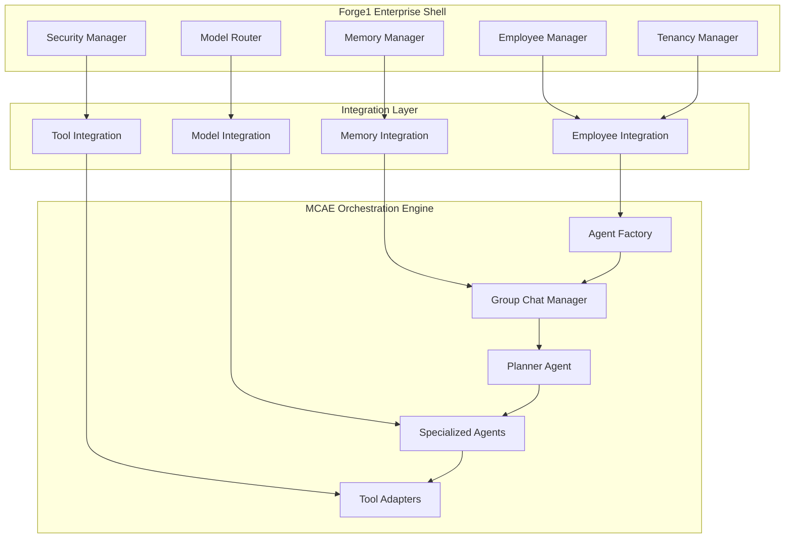

# Design Document

## Overview

This design integrates the Multi-Agent Custom Automation Engine (MCAE) as the orchestration spine for Forge1, creating a unified enterprise AI platform. MCAE will handle multi-agent workflows, tool execution, and collaboration, while Forge1 maintains its role as the enterprise shell providing tenancy, isolation, memory management, and compliance features.

The integration leverages existing components from both systems:
- **MCAE**: Agent factory, group chat manager, specialized agents, and workflow orchestration
- **Forge1**: Employee management, model routing, memory management, tenancy, and security

## Architecture

### High-Level Architecture



### Component Integration Points

1. **Employee Creation Flow**: Forge1 Employee Manager → MCAE Agent Factory
2. **Model Requests**: MCAE Agents → Forge1 Model Router
3. **Memory Operations**: MCAE Agents → Forge1 Memory Manager
4. **Tool Execution**: MCAE Tools → Forge1 Tool Registry (tenant-aware)

## Components and Interfaces

### 1. MCAE Integration Service

**Location**: `forge1/backend/forge1/integrations/mcae_adapter.py`

```python
class MCAEAdapter:
    """Adapter for integrating MCAE as Forge1's orchestration engine"""
    
    def __init__(self, employee_manager, model_router, memory_manager):
        self.employee_manager = employee_manager
        self.model_router = model_router  
        self.memory_manager = memory_manager
        self.mcae_factory = None
        
    async def initialize(self):
        """Initialize MCAE components with Forge1 context"""
        
    async def register_employee_workflow(self, employee: Employee) -> str:
        """Register employee in MCAE and return workflow ID"""
        
    async def execute_workflow(self, workflow_id: str, task: str, context: Dict) -> Dict:
        """Execute workflow through MCAE orchestration"""
```

### 2. Forge1-Aware Agent Factory

**Location**: `forge1/backend/forge1/integrations/forge1_agent_factory.py`

```python
class Forge1AgentFactory(AgentFactory):
    """Extended MCAE Agent Factory with Forge1 integration"""
    
    def __init__(self, tenant_id: str, employee_manager, model_router, memory_manager):
        super().__init__()
        self.tenant_id = tenant_id
        self.employee_manager = employee_manager
        self.model_router = model_router
        self.memory_manager = memory_manager
        
    async def create_agent_for_employee(self, employee: Employee) -> BaseAgent:
        """Create MCAE agent configured with Forge1 employee settings"""
```

### 3. Forge1 Model Client

**Location**: `forge1/backend/forge1/integrations/forge1_model_client.py`

```python
class Forge1ModelClient:
    """Model client that routes through Forge1's model router"""
    
    def __init__(self, tenant_id: str, employee_id: str, model_router: ModelRouter):
        self.tenant_id = tenant_id
        self.employee_id = employee_id
        self.model_router = model_router
        
    async def generate(self, prompt: str, **kwargs) -> str:
        """Generate response through Forge1 model router"""
        
    async def chat(self, messages: List[Dict], **kwargs) -> str:
        """Chat completion through Forge1 model router"""
```

### 4. Forge1 Memory Store

**Location**: `forge1/backend/forge1/integrations/forge1_memory_store.py`

```python
class Forge1MemoryStore(CosmosMemoryContext):
    """MCAE memory store that uses Forge1's memory manager"""
    
    def __init__(self, session_id: str, user_id: str, tenant_id: str, 
                 employee_id: str, memory_manager: MemoryManager):
        super().__init__(session_id, user_id)
        self.tenant_id = tenant_id
        self.employee_id = employee_id
        self.memory_manager = memory_manager
        
    async def add_item(self, item) -> str:
        """Store item through Forge1 memory manager with tenant isolation"""
        
    async def get_data_by_type(self, data_type: str) -> List:
        """Retrieve data through Forge1 memory manager"""
```

### 5. Tenant-Aware Tool Adapters

**Location**: `forge1/backend/forge1/integrations/mcae_tools/`

```python
class TenantAwareDocumentParser:
    """Document parsing tool with tenant isolation"""
    
    def __init__(self, tenant_id: str, employee_id: str):
        self.tenant_id = tenant_id
        self.employee_id = employee_id
        
    async def parse_document(self, document_path: str) -> Dict:
        """Parse document with tenant-scoped access"""

class TenantAwareVectorSearch:
    """Vector search tool with tenant isolation"""
    
    async def search(self, query: str, limit: int = 10) -> List[Dict]:
        """Search within tenant's vector space only"""

class TenantAwareSlackPoster:
    """Slack posting tool with tenant-specific credentials"""
    
    async def post_message(self, channel: str, message: str) -> bool:
        """Post to tenant-specific Slack workspace"""

class TenantAwareDriveFetcher:
    """Google Drive fetcher with tenant-scoped access"""
    
    async def fetch_file(self, file_id: str) -> bytes:
        """Fetch file from tenant's authorized Drive"""
```

### 6. Enhanced Employee Manager

**Updates to**: `forge1/backend/forge1/services/employee_manager.py`

```python
class EmployeeManager:
    # Existing code...
    
    def __init__(self, ..., mcae_adapter: Optional[MCAEAdapter] = None):
        # Existing initialization...
        self.mcae_adapter = mcae_adapter
        
    async def create_employee(self, client_id: str, requirements: EmployeeRequirements) -> Employee:
        # Existing employee creation...
        employee = await self.client_manager.create_employee_for_client(client_id, requirements)
        
        # NEW: Register employee in MCAE
        if self.mcae_adapter:
            workflow_id = await self.mcae_adapter.register_employee_workflow(employee)
            employee.workflow_id = workflow_id
            await self._update_employee_workflow_id(employee.id, workflow_id)
            
        return employee
        
    async def execute_employee_task(self, client_id: str, employee_id: str, 
                                  task: str, context: Dict = None) -> Dict:
        """Execute task through MCAE orchestration"""
        employee = await self.load_employee(client_id, employee_id)
        if not employee.workflow_id:
            raise ValueError(f"Employee {employee_id} not registered in MCAE")
            
        return await self.mcae_adapter.execute_workflow(
            employee.workflow_id, task, context or {}
        )
```

## Data Models

### 1. Enhanced Employee Model

**Updates to**: `forge1/backend/forge1/models/employee_models.py`

```python
@dataclass
class Employee:
    # Existing fields...
    workflow_id: Optional[str] = None  # MCAE workflow identifier
    mcae_agent_config: Optional[Dict[str, Any]] = None  # MCAE-specific configuration
    
class EmployeeRequirements:
    # Existing fields...
    workflow_type: Optional[str] = "standard"  # Type of MCAE workflow to create
    collaboration_mode: Optional[str] = "sequential"  # How agents collaborate
```

### 2. Workflow Context Model

**New file**: `forge1/backend/forge1/models/workflow_models.py`

```python
@dataclass
class WorkflowContext:
    """Context passed to MCAE workflows"""
    tenant_id: str
    employee_id: str
    session_id: str
    user_id: str
    task_description: str
    memory_context: List[Dict] = field(default_factory=list)
    tool_permissions: List[str] = field(default_factory=list)
    model_preferences: Optional[Dict] = None
    
@dataclass
class WorkflowResult:
    """Result from MCAE workflow execution"""
    workflow_id: str
    session_id: str
    status: str  # "completed", "failed", "in_progress"
    result: Optional[Dict] = None
    error: Optional[str] = None
    agent_messages: List[Dict] = field(default_factory=list)
    tokens_used: int = 0
    cost: Decimal = field(default_factory=lambda: Decimal('0.00'))
```

## Error Handling

### 1. Integration Error Types

```python
class MCAEIntegrationError(Exception):
    """Base exception for MCAE integration errors"""
    pass

class WorkflowRegistrationError(MCAEIntegrationError):
    """Error registering employee workflow in MCAE"""
    pass

class WorkflowExecutionError(MCAEIntegrationError):
    """Error executing MCAE workflow"""
    pass

class TenantIsolationViolationError(MCAEIntegrationError):
    """Error when tenant isolation is violated"""
    pass
```

### 2. Error Handling Strategy

1. **Graceful Degradation**: If MCAE is unavailable, fall back to Forge1's existing orchestration
2. **Tenant Isolation Enforcement**: Immediately terminate workflows that violate tenant boundaries
3. **Resource Cleanup**: Ensure MCAE resources are properly cleaned up on errors
4. **Audit Logging**: Log all integration errors for compliance and debugging

## Testing Strategy

### 1. Unit Tests

- **MCAE Adapter Tests**: Test employee registration and workflow execution
- **Model Client Tests**: Test model routing through Forge1
- **Memory Store Tests**: Test memory operations with tenant isolation
- **Tool Adapter Tests**: Test tenant-aware tool execution

### 2. Integration Tests

- **End-to-End Workflow Tests**: Test complete employee workflow execution
- **Tenant Isolation Tests**: Verify no cross-tenant data access
- **Failover Tests**: Test graceful degradation when MCAE is unavailable
- **Performance Tests**: Test workflow execution performance

### 3. Test Scenarios

#### Scenario 1: Law Firm Employee Creation and Workflow
```python
async def test_law_firm_workflow():
    # Create tenant and employees
    tenant_id = "law_firm_123"
    
    # Create Intake employee
    intake_employee = await employee_manager.create_employee(
        tenant_id, 
        EmployeeRequirements(
            name="Legal Intake Specialist",
            role="intake",
            workflow_type="legal_intake"
        )
    )
    
    # Create Lawyer employee  
    lawyer_employee = await employee_manager.create_employee(
        tenant_id,
        EmployeeRequirements(
            name="Senior Attorney", 
            role="lawyer",
            workflow_type="legal_analysis"
        )
    )
    
    # Create Research employee
    research_employee = await employee_manager.create_employee(
        tenant_id,
        EmployeeRequirements(
            name="Legal Researcher",
            role="research", 
            workflow_type="legal_research"
        )
    )
    
    # Execute workflow: Intake → Lawyer → Research
    intake_result = await employee_manager.execute_employee_task(
        tenant_id, intake_employee.id,
        "Process new client case: Contract dispute with vendor"
    )
    
    lawyer_result = await employee_manager.execute_employee_task(
        tenant_id, lawyer_employee.id,
        f"Analyze case from intake: {intake_result['summary']}"
    )
    
    research_result = await employee_manager.execute_employee_task(
        tenant_id, research_employee.id,
        f"Research precedents for: {lawyer_result['legal_issues']}"
    )
    
    # Verify tenant isolation
    assert all(result['tenant_id'] == tenant_id for result in [intake_result, lawyer_result, research_result])
    
    # Verify no cross-tenant access
    other_tenant_id = "law_firm_456"
    with pytest.raises(TenantIsolationError):
        await employee_manager.execute_employee_task(
            other_tenant_id, intake_employee.id, "Unauthorized access attempt"
        )
```

### 4. Performance Benchmarks

- **Workflow Creation Time**: < 500ms per employee
- **Task Execution Time**: < 2s for simple tasks, < 30s for complex workflows
- **Memory Overhead**: < 50MB per active workflow
- **Concurrent Workflows**: Support 100+ concurrent workflows per tenant

## Implementation Plan

### Phase 1: Core Integration (Week 1-2)
1. Create MCAE adapter and integration interfaces
2. Implement Forge1-aware agent factory
3. Create Forge1 model client and memory store
4. Update employee manager with MCAE registration

### Phase 2: Tool Integration (Week 3)
1. Implement tenant-aware tool adapters
2. Create tool registry integration
3. Add tool permission enforcement
4. Test basic tool execution

### Phase 3: Workflow Execution (Week 4)
1. Implement end-to-end workflow execution
2. Add error handling and failover logic
3. Implement audit logging and monitoring
4. Test law firm scenario

### Phase 4: Production Readiness (Week 5)
1. Performance optimization and testing
2. Security audit and compliance verification
3. Documentation and deployment guides
4. Production deployment and monitoring

## Security Considerations

### 1. Tenant Isolation
- All MCAE operations must include tenant context
- Memory and tool access strictly scoped to tenant
- Cross-tenant workflow prevention

### 2. Authentication and Authorization
- Employee-level permissions enforced in MCAE
- Tool access based on employee configuration
- Model access controlled by Forge1 router

### 3. Data Protection
- All data flows through Forge1's DLP and encryption
- MCAE memory operations use Forge1's secure storage
- Audit trails for all cross-system operations

### 4. Compliance
- GDPR, HIPAA compliance maintained through Forge1
- Data residency requirements enforced
- Retention policies applied to MCAE workflows

## Monitoring and Observability

### 1. Metrics
- Workflow execution success/failure rates
- Average workflow execution time
- Resource utilization per tenant
- Cross-system integration health

### 2. Logging
- All MCAE operations logged with tenant context
- Integration point performance metrics
- Error tracking and alerting
- Compliance audit trails

### 3. Dashboards
- Real-time workflow status per tenant
- Employee utilization and performance
- System health and integration status
- Cost tracking per tenant and employee