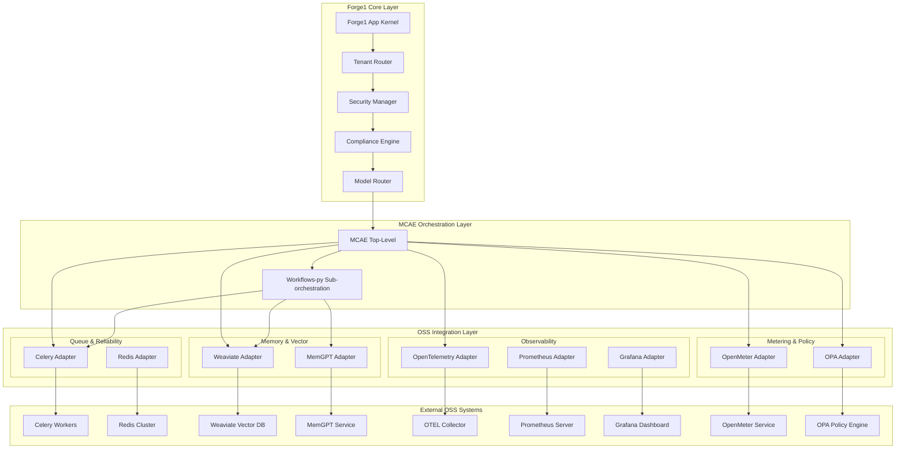

# Design Document

## Overview

This design integrates nine critical open-source systems into Forge1 as first-class production components while maintaining architectural integrity. The integration follows Forge1's established patterns of adapter-based integration, centralized tenancy management, and compliance-first design. Each OSS system will be wrapped behind Forge1 adapters to preserve the existing orchestration hierarchy where MCAE remains top-level orchestration and workflows-py serves as sub-orchestration.

The design ensures no global state ownership by external libraries, maintains tenant isolation, and provides comprehensive observability across all integrated components.

## Architecture

### High-Level Integration Architecture



### Integration Principles

1. **Adapter Pattern**: All OSS systems integrated behind Forge1 adapters
2. **Tenant Isolation**: All operations include tenant context and isolation
3. **No Global State**: OSS libraries cannot own global application state
4. **Compliance First**: All data flows through DLP and compliance validation
5. **Observability Native**: All operations generate traces, metrics, and logs
6. **Policy Enforcement**: All actions subject to OPA policy evaluation

## Components and Interfaces

### 1. Queue & Reliability Integration (Celery + Redis)

#### Celery Integration Adapter
```python
# forge1/integrations/queue/celery_app.py
class CeleryAdapter:
    def __init__(self, tenant_context: TenantContext):
        self.tenant_context = tenant_context
        self.app = self._create_tenant_aware_app()
    
    async def enqueue_task(self, task_name: str, payload: Dict, 
                          context: ExecutionContext) -> TaskResult
    
    async def get_task_status(self, task_id: str) -> TaskStatus
    
    def _create_tenant_aware_app(self) -> Celery
```

#### Task Definitions
```python
# forge1/integrations/queue/tasks.py
@celery_app.task(bind=True, autoretry_for=(Exception,), retry_kwargs={'max_retries': 5})
def execute_mcae_stage(self, stage_config: Dict, context: Dict) -> Dict

@celery_app.task(bind=True, autoretry_for=(Exception,), retry_kwargs={'max_retries': 3})
def process_document_embedding(self, doc_id: str, context: Dict) -> Dict

@celery_app.task(bind=True, autoretry_for=(Exception,), retry_kwargs={'max_retries': 3})
def execute_llamaindex_tool(self, tool_name: str, params: Dict, context: Dict) -> Dict
```

#### Redis Integration
```python
# forge1/integrations/queue/redis_client.py
class RedisAdapter:
    def __init__(self, tenant_context: TenantContext):
        self.tenant_context = tenant_context
        self.client = self._create_tenant_aware_client()
    
    async def get_namespaced_key(self, key: str) -> str
    async def set_with_tenant_isolation(self, key: str, value: Any, ttl: int = None)
    async def get_with_tenant_isolation(self, key: str) -> Any
```

### 2. Memory & Vector Integration (Weaviate + MemGPT)

#### Weaviate Vector Store Adapter
```python
# forge1/integrations/vector/weaviate_client.py
class WeaviateAdapter:
    def __init__(self, tenant_context: TenantContext):
        self.tenant_context = tenant_context
        self.client = self._create_tenant_aware_client()
    
    async def create_tenant_schema(self, tenant_id: str) -> bool
    async def store_vector(self, vector_data: VectorData, context: ExecutionContext) -> str
    async def search_vectors(self, query: VectorQuery, context: ExecutionContext) -> List[VectorResult]
    
    def _get_tenant_class_name(self, base_class: str) -> str
```

#### MemGPT Memory Compression
```python
# forge1/core/memory/memgpt_summarizer.py
class MemGPTSummarizer:
    def __init__(self, model_router: ModelRouter):
        self.model_router = model_router
        self.compression_threshold = 8000  # tokens
    
    async def compress_memory_context(self, context: MemoryContext) -> CompressedMemory
    async def apply_ttl_policy(self, memory_id: str, policy: TTLPolicy) -> bool
    async def schedule_compression_job(self, memory_id: str) -> str
```

#### Enhanced Memory Store Integration
```python
# forge1/core/memory/vector_store_weaviate.py
class WeaviateMemoryAdapter(MemoryAdapter):
    def __init__(self, weaviate_adapter: WeaviateAdapter, memgpt_summarizer: MemGPTSummarizer):
        self.weaviate = weaviate_adapter
        self.summarizer = memgpt_summarizer
    
    async def store_memory(self, memory: MemoryContext) -> str
    async def retrieve_memory(self, query: MemoryQuery) -> List[MemoryResult]
    async def compress_old_memories(self, tenant_id: str) -> CompressionResult
```

### 3. Observability Integration (OpenTelemetry + Prometheus + Grafana)

#### OpenTelemetry Integration
```python
# forge1/integrations/observability/otel_init.py
class OTELIntegration:
    def __init__(self):
        self.tracer_provider = self._setup_tracer_provider()
        self.meter_provider = self._setup_meter_provider()
    
    def instrument_fastapi(self, app: FastAPI) -> None
    def instrument_celery(self, celery_app: Celery) -> None
    def instrument_database_calls(self) -> None
    def instrument_model_router_calls(self) -> None
```

#### Custom Metrics Collection
```python
# forge1/integrations/observability/metrics.py
class ForgeMetrics:
    def __init__(self, meter_provider: MeterProvider):
        self.meter = meter_provider.get_meter("forge1")
        self._setup_business_metrics()
    
    def record_task_execution(self, task_type: str, duration: float, tenant_id: str)
    def record_model_usage(self, model: str, tokens: int, cost: float, tenant_id: str)
    def record_policy_decision(self, decision: str, resource: str, tenant_id: str)
```

#### Grafana Dashboard Configuration
```python
# forge1/integrations/observability/grafana_config.py
class GrafanaDashboardManager:
    def __init__(self, grafana_client: GrafanaClient):
        self.client = grafana_client
    
    async def create_tenant_dashboard(self, tenant_id: str) -> str
    async def update_dashboard_panels(self, dashboard_id: str, panels: List[Panel])
    async def setup_alerting_rules(self, tenant_id: str, rules: List[AlertRule])
```

### 4. Usage Metering Integration (OpenMeter)

#### OpenMeter Client Adapter
```python
# forge1/integrations/metering/openmeter_client.py
class OpenMeterAdapter:
    def __init__(self, api_endpoint: str, api_key: str):
        self.client = OpenMeterClient(api_endpoint, api_key)
    
    async def emit_usage_event(self, event: UsageEvent) -> bool
    async def get_usage_summary(self, tenant_id: str, period: TimePeriod) -> UsageSummary
    async def export_usage_csv(self, tenant_id: str, month: str) -> str
```

#### Usage Event Service
```python
# forge1/services/usage_events.py
class UsageEventService:
    def __init__(self, openmeter_adapter: OpenMeterAdapter):
        self.openmeter = openmeter_adapter
    
    async def record_model_usage(self, context: ExecutionContext, usage: ModelUsage)
    async def record_tool_execution(self, context: ExecutionContext, tool_usage: ToolUsage)
    async def record_storage_usage(self, context: ExecutionContext, storage_usage: StorageUsage)
```

### 5. Policy Engine Integration (OPA)

#### OPA Client Adapter
```python
# forge1/policy/opa_client.py
class OPAAdapter:
    def __init__(self, opa_endpoint: str):
        self.client = OPAClient(opa_endpoint)
        self.policy_cache = {}
    
    async def evaluate_policy(self, input_data: PolicyInput) -> PolicyDecision
    async def load_policy_bundle(self, bundle_path: str) -> bool
    async def update_policy(self, policy_name: str, policy_content: str) -> bool
```

#### Policy Enforcement Middleware
```python
# forge1/middleware/policy_enforcer.py
class PolicyEnforcementMiddleware:
    def __init__(self, opa_adapter: OPAAdapter):
        self.opa = opa_adapter
    
    async def __call__(self, request: Request, call_next: Callable) -> Response
    async def enforce_tool_access_policy(self, context: ExecutionContext, tool_name: str) -> bool
    async def enforce_document_access_policy(self, context: ExecutionContext, doc_id: str) -> bool
```

## Data Models

### Execution Context
```python
@dataclass
class ExecutionContext:
    tenant_id: str
    employee_id: str
    user_id: str
    role: str
    request_id: str
    case_id: Optional[str] = None
    session_id: Optional[str] = None
    security_level: SecurityLevel = SecurityLevel.STANDARD
    compliance_flags: List[str] = field(default_factory=list)
```

### Task Configuration
```python
@dataclass
class TaskConfig:
    task_type: str
    priority: TaskPriority
    retry_policy: RetryPolicy
    timeout_seconds: int
    tenant_context: TenantContext
    compliance_requirements: List[ComplianceRequirement]
```

### Usage Event
```python
@dataclass
class UsageEvent:
    event_type: str
    tenant_id: str
    employee_id: str
    resource_type: str
    quantity: float
    unit: str
    timestamp: datetime
    metadata: Dict[str, Any]
    cost_estimate: Optional[float] = None
```

### Policy Input
```python
@dataclass
class PolicyInput:
    subject: Dict[str, Any]  # user/employee context
    resource: Dict[str, Any]  # resource being accessed
    action: str  # action being performed
    environment: Dict[str, Any]  # request context
    tenant_id: str
```

## Error Handling

### Retry Policies
- **Celery Tasks**: Exponential backoff with max 5 retries for MCAE stages, 3 retries for tool executions
- **Vector Operations**: Circuit breaker pattern with 60-second windows
- **Policy Evaluations**: Fail-safe to deny with audit logging
- **Usage Events**: Best-effort delivery with local queuing for failures

### Circuit Breaker Implementation
```python
class CircuitBreaker:
    def __init__(self, failure_threshold: int = 5, recovery_timeout: int = 60):
        self.failure_threshold = failure_threshold
        self.recovery_timeout = recovery_timeout
        self.failure_count = 0
        self.last_failure_time = None
        self.state = CircuitState.CLOSED
```

### Dead Letter Queue Handling
- Failed tasks routed to tenant-specific DLQ
- Automatic retry after exponential backoff
- Manual intervention interface for persistent failures
- Compliance audit trail for all failed operations

## Testing Strategy

### Unit Tests
- Adapter interface compliance tests
- Tenant isolation verification tests
- Policy enforcement unit tests
- Usage event generation tests
- Memory compression algorithm tests

### Integration Tests
- End-to-end workflow execution tests
- Cross-tenant isolation tests
- Failure injection and recovery tests
- Performance benchmark tests
- Compliance validation tests

### Load Tests
- Concurrent task execution scaling
- Vector search performance under load
- Policy evaluation latency tests
- Usage event throughput tests
- Memory compression efficiency tests

### Security Tests
- Tenant data isolation verification
- Policy bypass attempt tests
- DLP redaction effectiveness tests
- Authentication and authorization tests
- Audit trail completeness tests

## Performance Considerations

### Celery Configuration
- Separate queues for different workload types
- Worker pool sizing based on task characteristics
- Result backend optimization for large payloads
- Task routing based on tenant and priority

### Weaviate Optimization
- Tenant-based class sharding strategy
- Index optimization for common query patterns
- Batch operations for bulk data ingestion
- Connection pooling and caching

### Memory Management
- MemGPT compression scheduling optimization
- TTL policy enforcement automation
- Memory usage monitoring and alerting
- Garbage collection for expired contexts

### Observability Performance
- Sampling strategies for high-volume traces
- Metric aggregation and retention policies
- Dashboard query optimization
- Alert rule efficiency tuning

## Security and Compliance

### Data Protection
- All data encrypted in transit and at rest
- DLP redaction before persistence
- Tenant-specific encryption keys
- Secure credential management via SecretManager

### Access Control
- OPA policy enforcement at all integration points
- Role-based access control for all operations
- Audit logging for all policy decisions
- Regular policy compliance reviews

### Compliance Monitoring
- Automated compliance validation
- Real-time violation detection and alerting
- Compliance report generation
- Regulatory requirement mapping

## Deployment Architecture

### Container Configuration
```yaml
# docker-compose.integration.yml
services:
  celery-worker:
    image: forge1/celery-worker
    environment:
      - TENANT_ISOLATION=enabled
      - DLP_PROVIDER=presidio
    volumes:
      - ./policies:/app/policies
  
  weaviate:
    image: semitechnologies/weaviate
    environment:
      - AUTHENTICATION_ANONYMOUS_ACCESS_ENABLED=false
      - AUTHORIZATION_ADMINLIST_ENABLED=true
  
  opa:
    image: openpolicyagent/opa
    command: ["run", "--server", "/policies"]
    volumes:
      - ./policies:/policies
```

### Kubernetes Deployment
- Separate namespaces for each tenant
- Resource quotas and limits per tenant
- Network policies for service isolation
- Horizontal pod autoscaling based on queue depth

### Monitoring and Alerting
- Prometheus scrape configuration for all services
- Grafana dashboard provisioning
- Alert manager integration
- PagerDuty integration for critical alerts