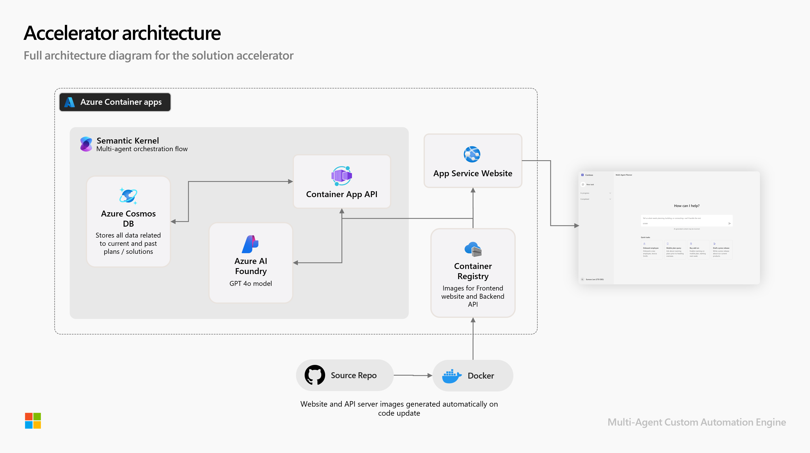
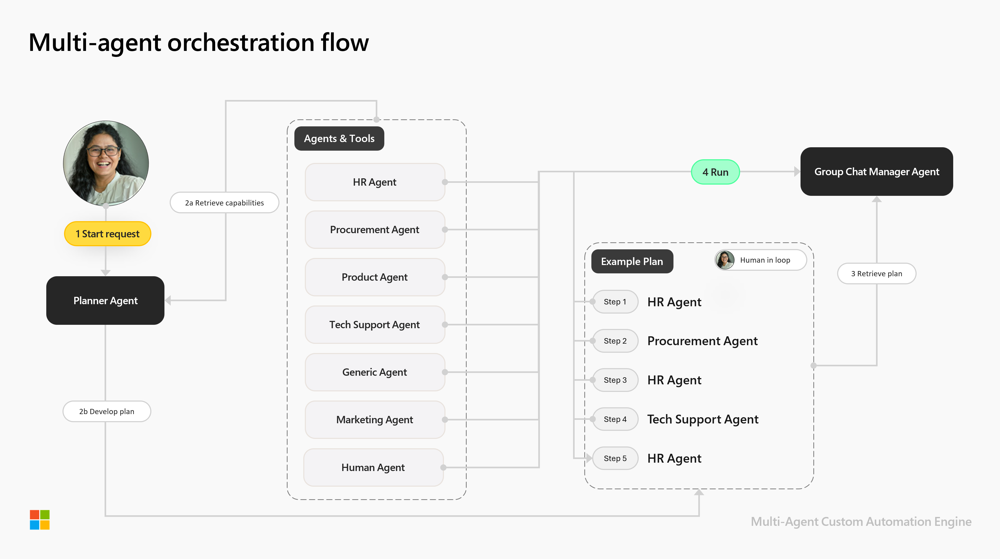
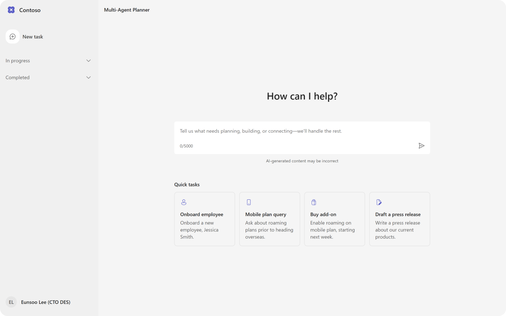

# Multi-Agent Custom Automation Engine Solution Accelerator

Welcome to the *Multi-Agent Custom Automation Engine* solution accelerator, designed to help businesses leverage AI agents for automating complex organizational tasks. This accelerator provides a foundation for building AI-driven orchestration systems that can coordinate multiple specialized agents to accomplish various business processes.

When dealing with complex organizational tasks, users often face significant challenges, including coordinating across multiple departments, maintaining consistency in processes, and ensuring efficient resource utilization.

The Multi-Agent Custom Automation Engine solution accelerator allows users to specify tasks and have them automatically processed by a group of AI agents, each specialized in different aspects of the business. This automation not only saves time but also ensures accuracy and consistency in task execution.

 

  
[**SOLUTION OVERVIEW**](#solution-overview) \| [**QUICK DEPLOY**](#quick-deploy) \| [**BUSINESS SCENARIO**](#business-scenario) \| [**SUPPORTING DOCUMENTATION**](#supporting-documentation)

 

<h2>
Solution overview
</h2>

The solution leverages Azure OpenAI Service, Azure Container Apps, Azure Cosmos DB, and Azure Container Registry to create an intelligent automation pipeline. It uses a multi-agent approach where specialized AI agents work together to plan, execute, and validate tasks based on user input.

### Solution architecture
||
|---|

### Agentic architecture
||
|---|

### How to customize
If you'd like to customize the solution accelerator, here are some common areas to start:

[Custom scenario](./docs/CustomizeSolution.md)

 

### Additional resources

[Semantic Kernel Documentation](https://learn.microsoft.com/en-us/semantic-kernel/)

[Azure AI Foundry Documentation](https://learn.microsoft.com/en-us/azure/ai-foundry/)

[Azure Container App documentation](https://learn.microsoft.com/en-us/azure/azure-functions/functions-how-to-custom-container?tabs=core-tools%2Cacr%2Cazure-cli2%2Cazure-cli&pivots=container-apps)

 

### Key features

  
Click to learn more about the key features this solution enables

  - **Allows people to focus on what matters**  
  By doing the heavy lifting involved with coordinating activities across an organization, people's time is freed up to focus on their specializations.
  
  - **Enabling GenAI to scale**  
  By not needing to build one application after another, organizations are able to reduce the friction of adopting GenAI across their entire organization. One capability can unlock almost unlimited use cases.

  - **Applicable to most industries**  
  These are common challenges that most organizations face, across most industries.

  - **Efficient task automation**  
  Streamlining the process of analyzing, planning, and executing complex tasks reduces time and effort required to complete organizational processes.

  
<h2>
Quick deploy
</h2>

### How to install or deploy
Follow the quick deploy steps on the deployment guide to deploy this solution to your own Azure subscription.

[Click here to launch the deployment guide](./docs/DeploymentGuide.md)
  

|  |  |
|---|---|
 
 

> ⚠️ **Important: Check Azure OpenAI Quota Availability**
  To ensure sufficient quota is available in your subscription, please follow [quota check instructions guide](./docs/quota_check.md) before you deploy the solution.

 

### Prerequisites and Costs

To deploy this solution accelerator, ensure you have access to an [Azure subscription](https://azure.microsoft.com/free/) with the necessary permissions to create **resource groups and resources**. Follow the steps in [Azure Account Set Up](./docs/AzureAccountSetUp.md).

Check the [Azure Products by Region](https://azure.microsoft.com/en-us/explore/global-infrastructure/products-by-region/table) page and select a **region** where the following services are available: Azure OpenAI Service, Azure AI Search, and Azure Semantic Search.

Here are some example regions where the services are available: East US, East US2, Japan East, UK South, Sweden Central.

Pricing varies per region and usage, so it isn't possible to predict exact costs for your usage. The majority of the Azure resources used in this infrastructure are on usage-based pricing tiers. However, Azure Container Registry has a fixed cost per registry per day.

Use the [Azure pricing calculator](https://azure.microsoft.com/en-us/pricing/calculator) to calculate the cost of this solution in your subscription. [Review a sample pricing sheet for the architecture](https://azure.com/e/86d0eefbe4dd4a23981c1d3d4f6fe7ed).
| Product | Description | Cost |
|---|---|---|
| [Azure OpenAI Service](https://learn.microsoft.com/azure/ai-services/openai/) | Powers the AI agents for task automation | [Pricing](https://azure.microsoft.com/pricing/details/cognitive-services/openai-service/) |
| [Azure Container Apps](https://learn.microsoft.com/azure/container-apps/) | Hosts the web application frontend | [Pricing](https://azure.microsoft.com/pricing/details/container-apps/) |
| [Azure Cosmos DB](https://learn.microsoft.com/azure/cosmos-db/) | Stores metadata and processing results | [Pricing](https://azure.microsoft.com/pricing/details/cosmos-db/) |
| [Azure Container Registry](https://learn.microsoft.com/azure/container-registry/) | Stores container images for deployment | [Pricing](https://azure.microsoft.com/pricing/details/container-registry/) |

 

>⚠️ **Important:** To avoid unnecessary costs, remember to take down your app if it's no longer in use,
either by deleting the resource group in the Portal or running `azd down`.

  
<h2>
Business Scenario
</h2>

||
|---|

 

Companies maintaining and modernizing their business processes often face challenges in coordinating complex tasks across multiple departments. They may have various processes that need to be automated and coordinated efficiently. Some of the challenges they face include:

- Difficulty coordinating activities across different departments
- Time-consuming process to manually manage complex workflows
- High risk of errors from manual coordination, which can lead to process inefficiencies
- Lack of available resources to handle increasing automation demands

By using the *Multi-Agent Custom Automation Engine* solution accelerator, users can automate these processes, ensuring that all tasks are accurately coordinated and executed efficiently.

### Business value

  
Click to learn more about what value this solution provides

  - **Process Efficiency**  
  Automate the coordination of complex tasks, significantly reducing processing time and effort.

  - **Error Reduction**  
  Multi-agent validation ensures accurate task execution and maintains process integrity.

  - **Resource Optimization**  
  Better utilization of human resources by focusing on specialized tasks.

  - **Cost Efficiency**  
  Reduces manual coordination efforts and improves overall process efficiency.

  - **Scalability**  
  Enables organizations to handle increasing automation demands without proportional resource increases.

  

<h2>
Supporting documentation
</h2>

### Security guidelines

This template uses Azure Key Vault to store all connections to communicate between resources.

This template also uses [Managed Identity](https://learn.microsoft.com/entra/identity/managed-identities-azure-resources/overview) for local development and deployment.

To ensure continued best practices in your own repository, we recommend that anyone creating solutions based on our templates ensure that the [Github secret scanning](https://docs.github.com/code-security/secret-scanning/about-secret-scanning) setting is enabled.

You may want to consider additional security measures, such as:

* Enabling Microsoft Defender for Cloud to [secure your Azure resources](https://learn.microsoft.com/en-us/azure/defender-for-cloud/).
* Protecting the Azure Container Apps instance with a [firewall](https://learn.microsoft.com/azure/container-apps/waf-app-gateway) and/or [Virtual Network](https://learn.microsoft.com/azure/container-apps/networking?tabs=workload-profiles-env%2Cazure-cli).

 

### Cross references
Check out similar solution accelerators

| Solution Accelerator | Description |
|---|---|
| [Document Knowledge Mining](https://github.com/microsoft/Document-Knowledge-Mining-Solution-Accelerator) | Extract structured information from unstructured documents using AI |
| [Modernize your Code](https://github.com/microsoft/Modernize-your-Code-Solution-Accelerator) | Automate the translation of SQL queries between different dialects |
| [Conversation Knowledge Mining](https://github.com/microsoft/Conversation-Knowledge-Mining-Solution-Accelerator) | Enable organizations to derive insights from volumes of conversational data using generative AI |

    

## Provide feedback

Have questions, find a bug, or want to request a feature? [Submit a new issue](https://github.com/microsoft/Multi-Agent-Custom-Automation-Engine-Solution-Accelerator/issues) on this repo and we'll connect.

 

## Responsible AI Transparency FAQ 
Please refer to [Transparency FAQ](./docs/TRANSPARENCY_FAQ.md) for responsible AI transparency details of this solution accelerator.

 

## Disclaimers

To the extent that the Software includes components or code used in or derived from Microsoft products or services, including without limitation Microsoft Azure Services (collectively, "Microsoft Products and Services"), you must also comply with the Product Terms applicable to such Microsoft Products and Services. You acknowledge and agree that the license governing the Software does not grant you a license or other right to use Microsoft Products and Services. Nothing in the license or this ReadMe file will serve to supersede, amend, terminate or modify any terms in the Product Terms for any Microsoft Products and Services. 

You must also comply with all domestic and international export laws and regulations that apply to the Software, which include restrictions on destinations, end users, and end use. For further information on export restrictions, visit https://aka.ms/exporting. 

You acknowledge that the Software and Microsoft Products and Services (1) are not designed, intended or made available as a medical device(s), and (2) are not designed or intended to be a substitute for professional medical advice, diagnosis, treatment, or judgment and should not be used to replace or as a substitute for professional medical advice, diagnosis, treatment, or judgment. Customer is solely responsible for displaying and/or obtaining appropriate consents, warnings, disclaimers, and acknowledgements to end users of Customer's implementation of the Online Services. 

You acknowledge the Software is not subject to SOC 1 and SOC 2 compliance audits. No Microsoft technology, nor any of its component technologies, including the Software, is intended or made available as a substitute for the professional advice, opinion, or judgment of a certified financial services professional. Do not use the Software to replace, substitute, or provide professional financial advice or judgment.  

BY ACCESSING OR USING THE SOFTWARE, YOU ACKNOWLEDGE THAT THE SOFTWARE IS NOT DESIGNED OR INTENDED TO SUPPORT ANY USE IN WHICH A SERVICE INTERRUPTION, DEFECT, ERROR, OR OTHER FAILURE OF THE SOFTWARE COULD RESULT IN THE DEATH OR SERIOUS BODILY INJURY OF ANY PERSON OR IN PHYSICAL OR ENVIRONMENTAL DAMAGE (COLLECTIVELY, "HIGH-RISK USE"), AND THAT YOU WILL ENSURE THAT, IN THE EVENT OF ANY INTERRUPTION, DEFECT, ERROR, OR OTHER FAILURE OF THE SOFTWARE, THE SAFETY OF PEOPLE, PROPERTY, AND THE ENVIRONMENT ARE NOT REDUCED BELOW A LEVEL THAT IS REASONABLY, APPROPRIATE, AND LEGAL, WHETHER IN GENERAL OR IN A SPECIFIC INDUSTRY. BY ACCESSING THE SOFTWARE, YOU FURTHER ACKNOWLEDGE THAT YOUR HIGH-RISK USE OF THE SOFTWARE IS AT YOUR OWN RISK. 
