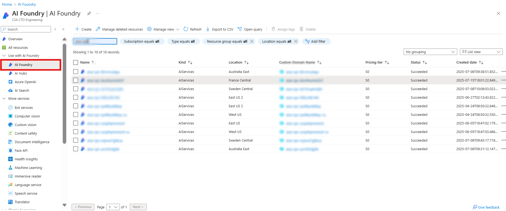
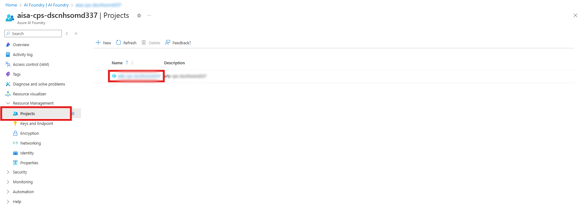
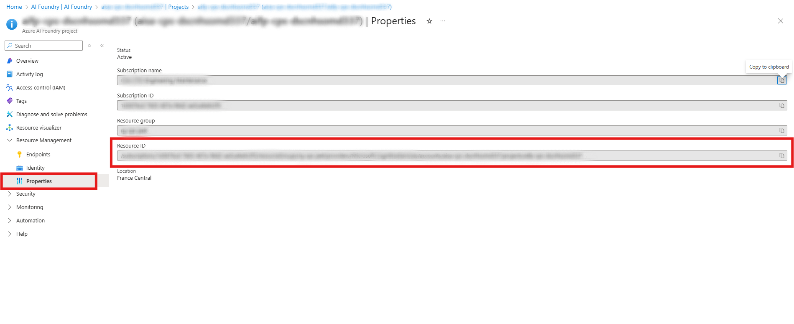

[← Back to *DEPLOYMENT* guide](/docs/DeploymentGuide.md#deployment-steps)

# Reusing an Existing Azure AI Foundry Project
To configure your environment to use an existing Azure AI Foundry Project, follow these steps:
---
### 1. Go to Azure Portal
Go to https://portal.azure.com

### 2. Search for Azure AI Foundry
In the search bar at the top, type "Azure AI Foundry" and click on it. Then select the Foundry service instance where your project exists.



### 3. Navigate to Projects under Resource Management
On the left sidebar of the Foundry service blade:

- Expand the Resource Management section
- Click on Projects (this refers to the active Foundry project tied to the service)

### 4. Click on the Project
From the Projects view: Click on the project name to open its details

    Note: You will see only one project listed here, as each Foundry service maps to a single project in this accelerator



### 5. Copy Resource ID
In the left-hand menu of the project blade: 

- Click on Properties under Resource Management
- Locate the Resource ID field
- Click on the copy icon next to the Resource ID value



### 6. Set the Foundry Project Resource ID in Your Environment
Run the following command in your terminal
```bash
azd env set AZURE_ENV_FOUNDRY_PROJECT_ID '<Existing Foundry Project Resource ID>'
```
Replace `<Existing Foundry Project Resource ID>` with the value obtained from Step 5.

### 7. Continue Deployment
Proceed with the next steps in the [deployment guide](/docs/DeploymentGuide.md#deployment-steps).
